# NightCrate Database Schema

**NightCrate version:** 0.34.0

Complete schema including existing tables and v0.8.0 equipment tables (revised design). All table names use singular form. Broken into logical groups for readability.

Authoritative source: `DB_SCHEMA_DDL.sql`

---

## 1. Existing Tables

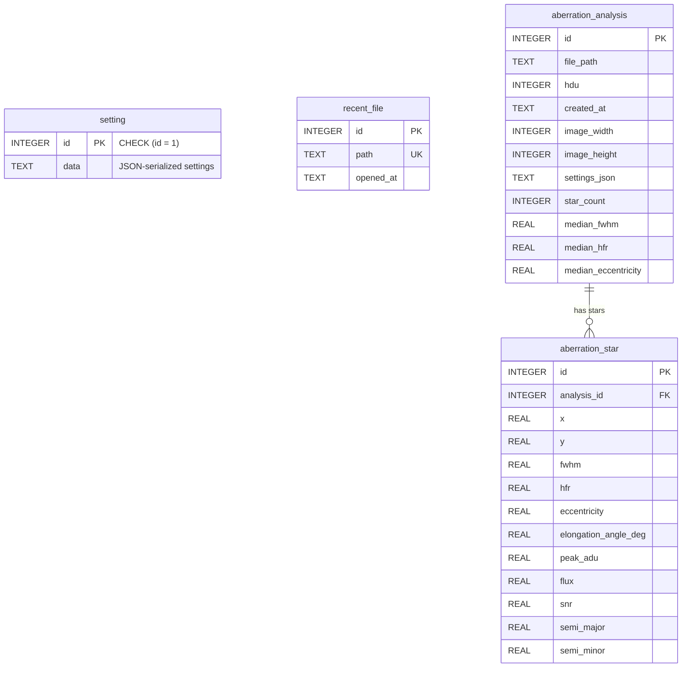

---

## 2. Lookup / Reference Tables

Shared reference data. All carry seed tracking columns (`created_at`, `updated_at`, `active`, `source`, `seed_key`, `seed_hash`) — omitted from diagram for readability.

```mermaid
erDiagram
    manufacturer {
        INTEGER id PK
        TEXT name UK
        TEXT website
        TEXT notes
    }

    optical_design {
        INTEGER id PK
        TEXT name UK
        TEXT description
    }

    mount_type {
        INTEGER id PK
        TEXT name UK
        TEXT description
    }

    connection_interface {
        INTEGER id PK
        TEXT name UK
        TEXT category "CHECK: data, control, power, wireless"
        TEXT notes
    }

    connector_size {
        INTEGER id PK
        TEXT name UK "M54, M48, T2, 2 inch, etc."
        REAL diameter_mm
        TEXT notes
    }

    filter_size {
        INTEGER id PK
        TEXT name UK "1.25 inch, 2 inch, 36mm, 50mm"
        TEXT description
    }

    computer_type {
        INTEGER id PK
        TEXT name UK "imaging, processing, control, general"
        TEXT description
    }

    filter_type {
        INTEGER id PK
        TEXT name UK "CHECK: 9 closed values"
        TEXT description
    }

    seed_loader_meta {
        TEXT key PK
        TEXT value
    }
```

`filter_type.name` is user-extensible (no CHECK constraint). Seed values: `luminance`, `broadband_color`, `narrowband_single`, `narrowband_dual`, `narrowband_tri`, `uv_ir_cut`, `light_pollution`, `neutral_density`, `other`.

---

## 3. Sensor

Sensor models shared across cameras. Many cameras use the same sensor (e.g., IMX571).

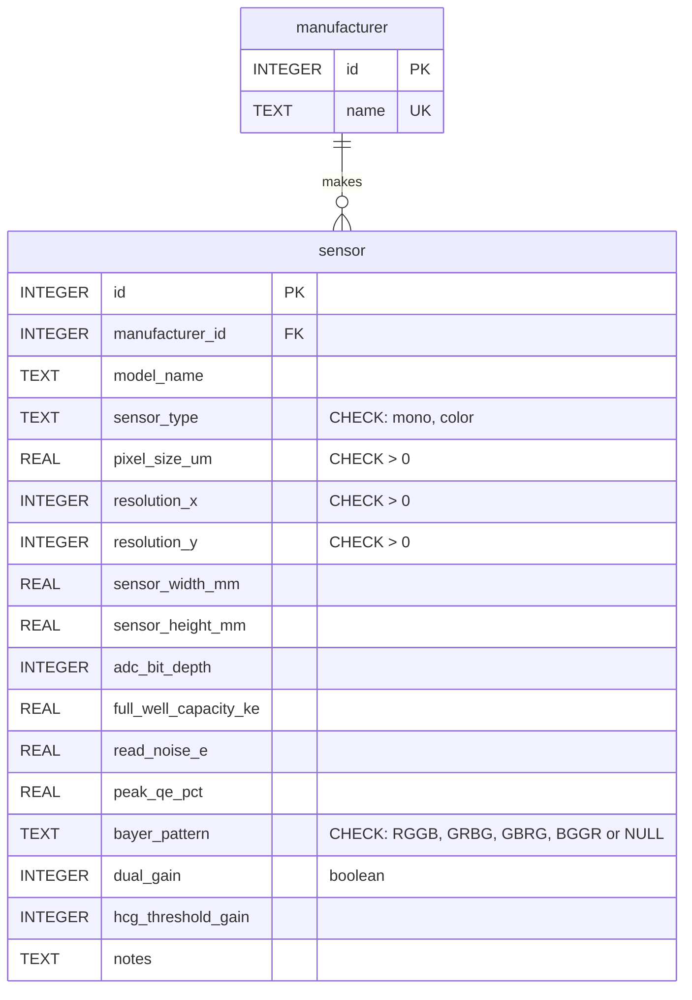

Constraint: `mono` sensors must have `bayer_pattern IS NULL`; `color` sensors must have `bayer_pattern IS NOT NULL`.

---

## 4. Camera

Imaging cameras reference sensor, manufacturer, connector size. Connection interfaces via junction table. USB hub modeled as boolean + optional interface FK.

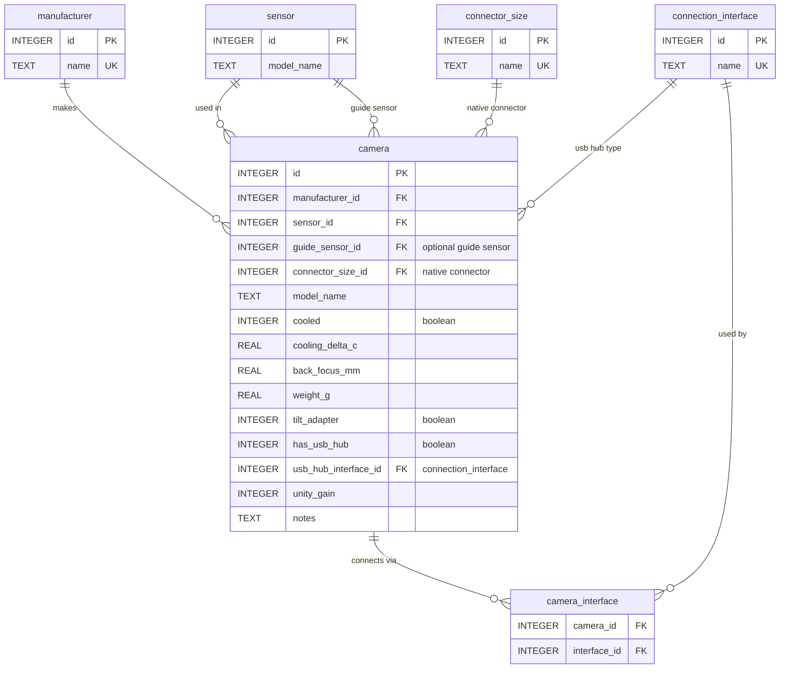

---

## 5. Telescope and Configuration

Base OTA carries only identity — aperture, optical design. All focal length/ratio/back_focus data lives on `telescope_configuration`. Every telescope must have at least one config with `is_native=1` (enforced by partial unique index).

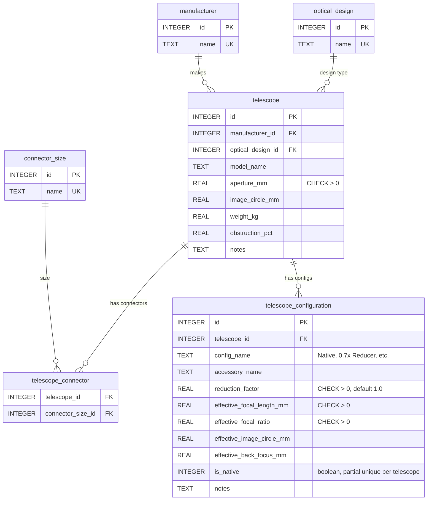

---

## 6. Filter and Passbands

`filter_type` describes the filter's role (narrowband_single, broadband_color, etc.). Wavelength data lives on `filter_passband` — one row for single-band, two for dual-band, three for tri-band.

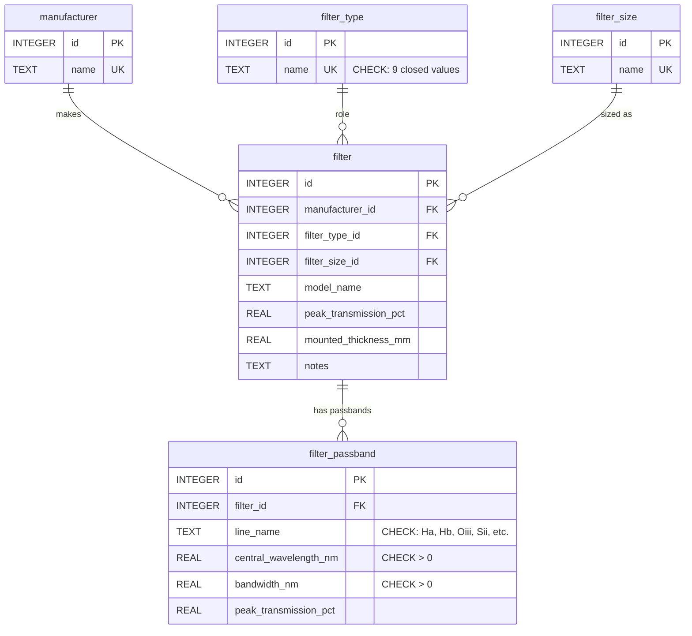

`filter_passband.line_name` CHECK: `Ha`, `Hb`, `Oiii`, `Sii`, `Nii`, `OI`, `Lum`, `R`, `G`, `B`, `UVIR`, `LP`, `ND`, `other`.

---

## 7. Mount

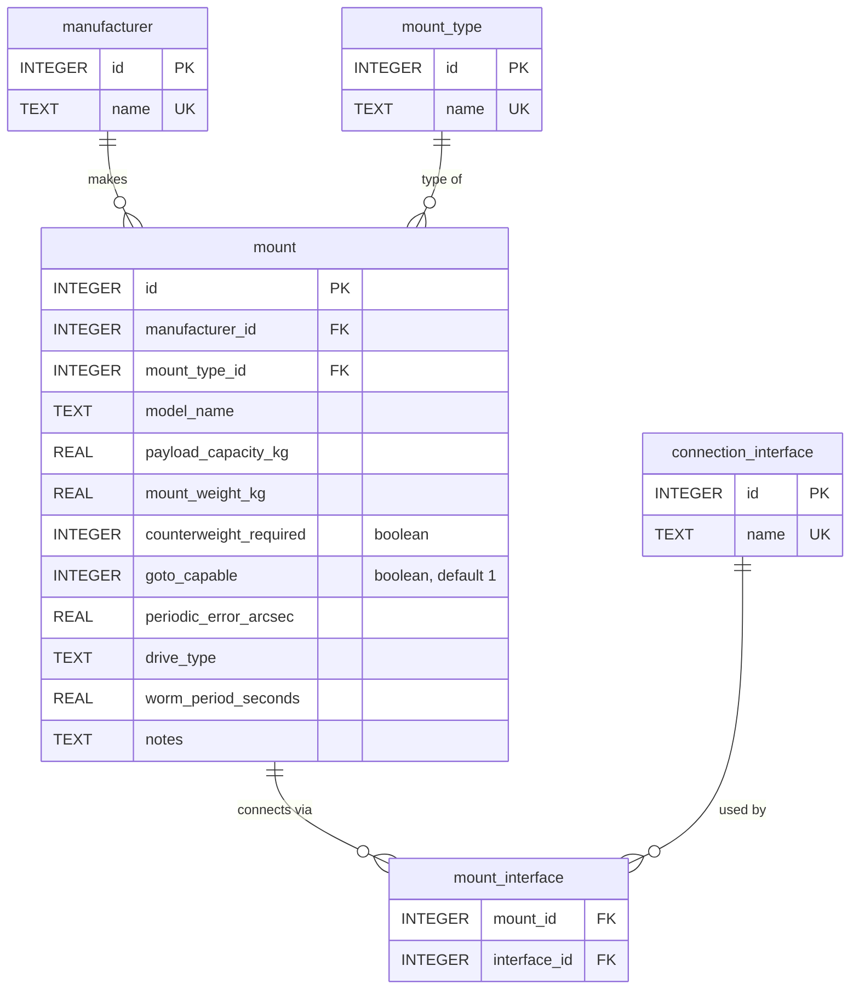

---

## 8. Focuser

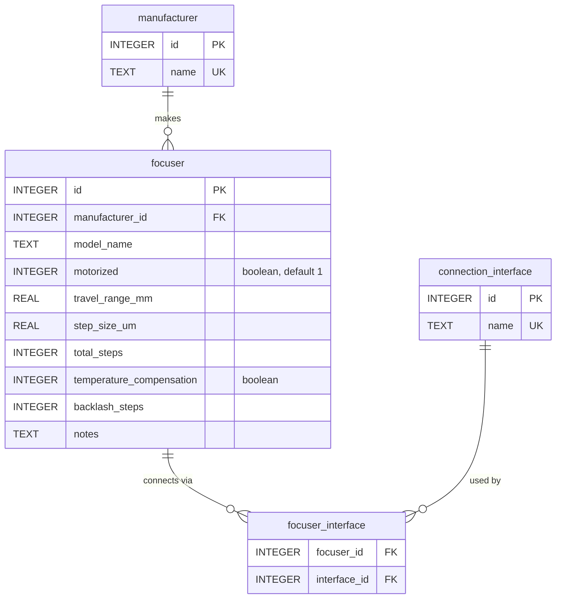

---

## 9. Filter Wheel

Connectors on both sides (camera side and telescope side). Accepts a specific filter size.

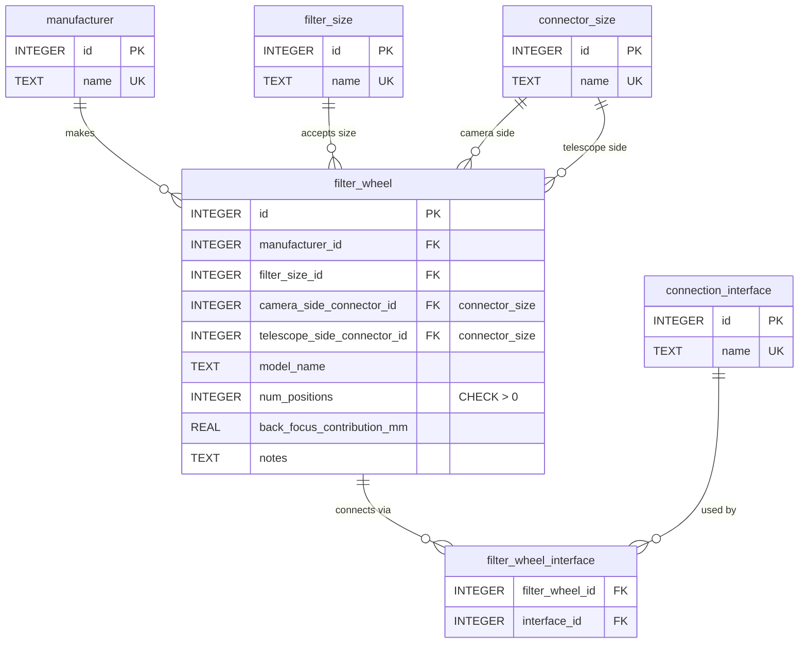

---

## 10. Guiding Equipment (OAG, Guide Scope)

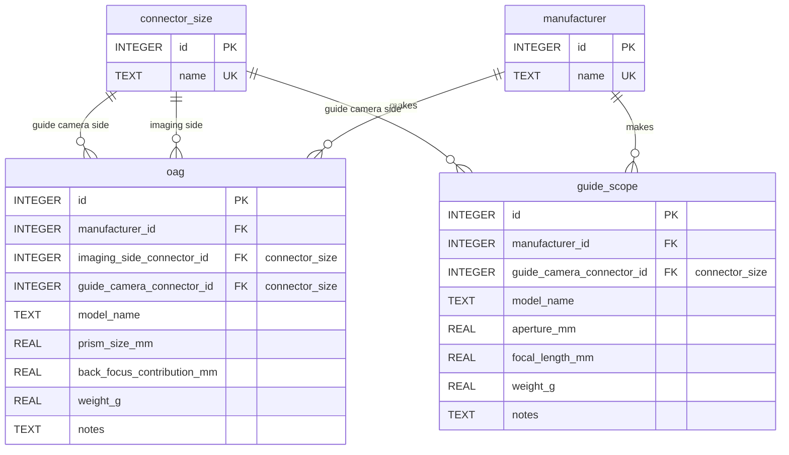

---

## 11. Computing and Software

`software.developer` replaced by `software.manufacturer_id` FK. Software category is a CHECK constraint.

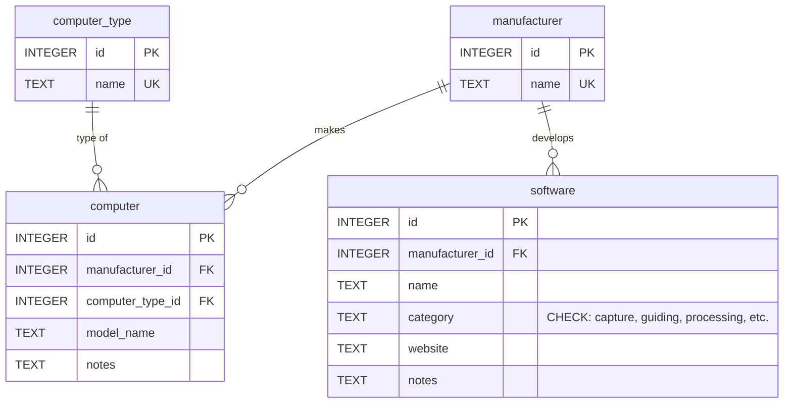

---

## 12. FITS Ingest Alias Tables

For auto-resolving FITS header values to equipment rows. Alias tables carry `source`, `confirmed`, and timestamp tracking. `unresolved_equipment_observation` records unknown header values pending user review.

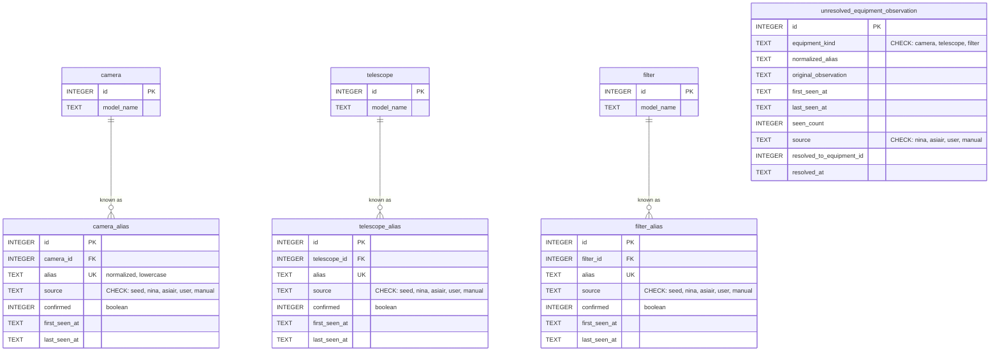

---

## 13. Global Columns (on every equipment and lookup table)

Omitted from diagrams for readability. Every seedable table carries:

| Column | Type | Purpose |
|--------|------|---------|
| `created_at` | TEXT DEFAULT datetime('now') | Row creation timestamp |
| `updated_at` | TEXT DEFAULT datetime('now') | Last modification (auto-updated via trigger) |
| `active` | INTEGER DEFAULT 1 CHECK (0,1) | Soft retirement — 0 hides from dropdowns, preserves historical references |
| `source` | TEXT DEFAULT 'user' CHECK ('seed','user') | Whether row came from seed data or user |
| `seed_key` | TEXT (partial unique index) | Stable identifier for seed loader matching |
| `seed_hash` | TEXT | SHA-256 of seed-originated fields for change detection |

---

## Table Summary

### Existing Tables (v0.1.0–v0.7.0)

| Table | Purpose |
|-------|---------|
| `setting` | Single-row JSON application settings |
| `recent_file` | Recently opened file paths with timestamps |
| `aberration_analysis` | Cached star detection results per image |
| `aberration_star` | Individual star measurements linked to analysis |

### v0.8.0 — Lookup / Reference (9 + 1 meta)

| Table | Purpose |
|-------|---------|
| `manufacturer` | Brands — referenced by all equipment types |
| `optical_design` | Telescope optical types (SCT, APO, RC, etc.) |
| `mount_type` | Mount classifications (GEM, Harmonic EQ, etc.) |
| `connection_interface` | USB 2.0, WiFi, ST-4, etc. (with category) |
| `connector_size` | M54, M48, T2, 2 inch, etc. (with diameter_mm) |
| `filter_size` | 1.25", 2", 36mm, 50mm |
| `computer_type` | imaging, processing, control, general |
| `filter_type` | Closed vocabulary: 9 filter role values |
| `seed_loader_meta` | Key/value store for seed loader state |

### v0.8.0 — Equipment (11)

| Table | Purpose |
|-------|---------|
| `sensor` | Camera sensor models with specs |
| `camera` | Imaging cameras — refs sensor, manufacturer, connector |
| `telescope` | OTAs — identity only (aperture, design). No focal length. |
| `telescope_configuration` | Focal length/ratio/back_focus per reducer/extender variant |
| `filter` | Physical filters — refs filter_type, manufacturer, size |
| `filter_passband` | Wavelength bands per physical filter (1 for single, 2+ for dual/tri) |
| `mount` | Tracking mounts |
| `focuser` | Motorized/manual focusers |
| `filter_wheel` | Filter wheel housings with connectors on both sides |
| `oag` | Off-axis guiders |
| `guide_scope` | Guide scopes |
| `computer` | Imaging/processing computers |
| `software` | Applications (capture, guiding, processing, etc.) |

### v0.8.0 — Junction (5)

| Table | Purpose |
|-------|---------|
| `camera_interface` | Camera ↔ connection interface |
| `telescope_connector` | Telescope ↔ connector size |
| `mount_interface` | Mount ↔ connection interface |
| `focuser_interface` | Focuser ↔ connection interface |
| `filter_wheel_interface` | Filter wheel ↔ connection interface |

### v0.8.0 — FITS Alias (4)

| Table | Purpose |
|-------|---------|
| `camera_alias` | INSTRUME header → camera row |
| `telescope_alias` | TELESCOP header → telescope row |
| `filter_alias` | FILTER header → filter row |
| `unresolved_equipment_observation` | Unknown header values pending user review |

### v0.8.0 — Views (1)

| View | Purpose |
|------|---------|
| `filter_summary` | Aggregated filter + type + passbands with GROUP_CONCAT |

### Weather & Location Tables

| Table | Purpose |
|-------|---------|
| `location` | User-defined observing locations (lat/lon, elevation, display timezone, geo_timezone, Bortle, SQM, typical_seeing_low_arcsec, typical_seeing_high_arcsec). Soft-delete via `active=0` (migration 0012) — pre-empts future session-ingestion references. |
| `weather_cache` | Cached API responses (forecast, ECMWF PWV, AOD) with TTL-based expiry |

### v0.12.0 — Rigs (3 tables + 1 view)

| Table / View | Purpose |
|--------------|---------|
| `rig` | User-composed imaging rig: one `telescope_configuration_id` + one `camera_id` required; optional `mount_id`, `focuser_id`, `filter_wheel_id`, `single_filter_id`, `oag_id`, `guide_scope_id`, `guide_camera_id`, `computer_id`. Default-rig flag with single-active enforcement at the API layer. Soft delete via `active=0`. |
| `rig_filter_slot` | Filter wheel slot assignments (rig_id, slot_number, filter_id). `UNIQUE(rig_id, slot_number)`. Validated at API layer against `filter_wheel.num_positions`. |
| `rig_software` | Junction table: many-to-many between rigs and software packages (e.g. NINA + PHD2 + ASIAIR on the same rig). Primary key `(rig_id, software_id)`. |
| `rig_summary` (view) | Joins rig with equipment to expose headline specs and equipment names for list rendering. Includes `telescope_id` (added in migration 0010), guide camera sensor fields for calculator consumption, and `sensor_adc_bit_depth` (added in migration 0013) for the File Size calculator's auto-populate-from-rig flow. |

### v0.12.0 — "My Equipment" flag

`is_mine INTEGER NOT NULL DEFAULT 0 CHECK(is_mine IN (0,1))` added to 10 owned equipment tables (`camera`, `telescope`, `filter`, `mount`, `focuser`, `filter_wheel`, `oag`, `guide_scope`, `computer`, `software`) with a partial index `idx_<table>_mine ON <table>(is_mine) WHERE is_mine = 1` on each. Sensors, lookup tables, junction tables, child tables, and alias tables are not touched — sensors aren't owned standalone. The flag is not tracked by the seed loader's hash contract, so marking a seeded item as mine does not trigger re-seed.

### v0.13.0 — Custom Horizons (2 tables)

| Table | Purpose |
|-------|---------|
| `location_horizon` | **Multi-horizon per location (v0.19.0).** 1:N with `location` (no UNIQUE on location_id). Columns: `id`, `location_id` (FK CASCADE), `name`, `type` (`'custom'` or `'artificial'`, CHECK), `flat_altitude_deg` (NOT NULL when artificial, in `[-5, 90]`; NULL for custom), `source` (`'imported'|'drawn'|NULL`, only meaningful for custom), `source_filename`, `notes`, `is_default`, `created_at`, `updated_at`. Partial unique index `(location_id) WHERE is_default=1` enforces exactly-one-default per location. Partial unique index `(location_id) WHERE type='custom'` enforces at-most-one-custom. `UNIQUE(location_id, name)`. Reshaped in migration 0021 (`0014` created the original 1:1 table; `0021` drops + recreates it preserving data and seeds a `0° flat` artificial default for every location that had no horizon). |
| `location_horizon_point` | `(azimuth_deg, altitude_deg)` points for **custom** horizons only. Composite PK on `(horizon_id, azimuth_deg)`. CHECK on `azimuth_deg ∈ [0, 360)` and `altitude_deg ∈ [-5, 90]`. Points cascade-delete with the horizon. Index on `(horizon_id, azimuth_deg)` for ordered fetch. Recreated by migration 0021 with an FK that points at the new `location_horizon` (the original FK was rewritten by SQLite's ALTER-RENAME to reference the legacy table and would have been invalidated). |

### v0.14.0 — DSO Catalog (3 tables)

| Table | Purpose |
|-------|---------|
| `dso_catalog_source` | Loader registry — one row per source file (OpenNGC main + addendum for v0.14.0). Carries `file_hash` (sha256 used for idempotent reload), `category` CHECK ∈ `{'openngc','vizier','nightcrate','wikidata'}` (widened in migration 0022 to admit Wikidata SPARQL dumps), version, source URL, license, attribution, row_count. Created in migration 0015. |
| `dso` | Canonical DSO row. Denormalized `primary_designation` drives display. Closed CHECK vocabulary on `obj_type` (19 values + `'Other'` escape hatch preserving the upstream code in `raw_obj_type`). Coordinates (J2000), geometry, photometry (B/V/J/H/K + surface brightness), morphology (Hubble type, z, radial velocity, proper motion), planetary-nebula central-star columns, `raw_other_id` verbatim for future re-parse, editorial placeholders (`popularity_rank`, `difficulty`, `recommended_filter_id` FK → `filter`) unused in this pass. Indexes on `obj_type`, `constellation`, `primary_designation`, `source_catalog_id`. `updated_at` trigger. **v0.15.0 additions (migration 0016):** `distance_pc` (parsecs), `distance_method` (CHECK ∈ `{50mgc, curated, redshift}`, nullable; precedence is curated > 50 MGC > redshift, enforced structurally via `WHERE distance_pc IS NULL` in each augmenter), `common_name_augmented` and `surface_brightness_augmented` `{0,1}` provenance flags driving the UI "augmented" indicator. |
| `dso_designation` | Many-to-one: many designations per DSO. 29-prefix closed CHECK vocabulary on `catalog` (ngc, ic, messier, caldwell, ugc, pgc, mcg, eso, arp, hickson, sharpless2, barnard, ldn, lbn, vdb, cederblad, pk, rcw, gum, mrk, terzan, pal, mel, cr, stock, ruprecht, abell, dolidze, dwb). `UNIQUE(catalog, identifier)` — the same designation cannot point to two DSOs. Partial unique index enforces one `is_primary = 1` per DSO. `search_key` column (lowercase + whitespace/dash-stripped display form) powers fast designation lookup. |
| `thumbnail_cache` (v0.16.0 migration 0017, extended by v0.17.0 migrations 0018 + 0019) | Target Planner LRU thumbnail cache metadata. Files live on disk under `APP_DIR/thumbnails/`. Rows carry `dso_id` FK (cascade-delete), `variant` (`list`/`detail`/`rig_framed`/`fov_simulator`), dimensions, nullable `fov_major_deg_x1000` / `fov_minor_deg_x1000` for rig-dependent variants, nullable `center_ra_deg_x1000` / `center_dec_deg_x1000` for panned `fov_simulator` tiles at arbitrary sky centres (NULL = pin to DSO native coords), absolute `file_path`, `source` (`dss2_color`/`dss2_red`/`dss2_blue`/`placeholder`), `bytes`, `fetched_at`, `last_access_at`, and a nullable `fetch_error` (non-null rows are backoff sentinels that expire after 1 hour). Unique index spans `dso_id, variant, width, height, COALESCE(fov_major_deg_x1000, -1), COALESCE(fov_minor_deg_x1000, -1), COALESCE(center_ra_deg_x1000, -999999), COALESCE(center_dec_deg_x1000, -999999)` — distinct sentinels keep NULL separate from legitimate 0.0 RA. Index on `last_access_at` drives LRU eviction. Migration 0018 rebuilds the table (Pass A `detail` entries are wiped); 0019 ALTER-adds the centre columns + rebuilds the unique index — an app-startup orphan sweep deletes any now-stale on-disk JPEGs. **v0.18.0:** the `fov_simulator` variant is retired — the simulator now pulls from the DSO-agnostic `sky_tile_cache` table below. The `center_*_x1000` columns become vestigial for the simulator path (other variants default NULL). |

### v0.18.0 — Target Planner Pass C Sky-Tile Cache (1 table)

| Table | Purpose |
|-------|---------|
| `sky_tile_cache` (migration 0020) | DSO-agnostic tile cache for the FOV Simulator and DSO-catalog auto-zoom previews. Cells are keyed by `(hips_survey, healpix_nside, healpix_ipix, tier, cell_size_deg_x100, cell_width_px, cell_height_px, cell_i, cell_j)` — no FK to `dso`. NSIDE=8 partitions the sphere into 768 equal-area HEALPix regions; every cell in a region shares the region's tangent plane and tiles pixel-perfectly at shared edges. `tier` CHECK ∈ `{'narrow','med','wide'}` selects one of three resolution steps from the rig's major FOV. `source` CHECK ∈ `{'dss2_color','dss2_red','dss2_blue','placeholder'}`. Stores `file_path`, `bytes`, `fetched_at`, `last_access_at`, and a nullable `fetch_error` (same 1-hour backoff semantics as `thumbnail_cache`). Unique index spans the full key; additional indexes on `last_access_at` (LRU) and `(healpix_nside, healpix_ipix)` (region lookups). Two DSOs whose composites overlap inside a region share every cell in the overlap — the defining performance win over the DSO-keyed `thumbnail_cache`. |

### v0.20.0 — DSO External References (1 table; v0.21.1 widens provider CHECK)

| Table | Purpose |
|-------|---------|
| `dso_external_ref` (migrations 0022 + 0023) | Associates Wikidata QIDs, Wikipedia article URLs, SIMBAD cross-references, and NED galaxy-DB links with canonical DSOs. Columns: `dso_id` (FK CASCADE), `provider` (CHECK ∈ `{'wikidata','wikipedia','simbad','ned'}` after migration 0023), nullable `language` (required for wikipedia, forbidden for the three language-agnostic providers — enforced in loader code), `identifier` (QID / article slug / SIMBAD ID / primary designation), `url`, `label`, optional `source_catalog_id`, `created_at`, `updated_at` (with trigger). `UNIQUE(dso_id, provider, language)` enforces one row per DSO per provider per language; a partial unique index `(dso_id, provider) WHERE language IS NULL` covers the language-agnostic case (SQLite treats NULLs as distinct in the main unique index). No global uniqueness on `(provider, language, identifier)` — a single resource may legitimately span multiple DSOs (Stephan's Quintet article = 5 galaxies; Crab Nebula Wikidata QID = NGC 1952 + Sh2-244). Populated by `catalog_loader/wikidata_loader.py` (bulk SPARQL fetch — Wikipedia + Wikidata + SIMBAD from P3083; NED synthesised from primary_designation gated by `GALAXY_TYPES`) and `catalog_loader/external_refs_loader.py` (editorial CSV overrides — precedence "later wins"). |

### v0.35.0 — Projects (2 tables)

| Table | Purpose |
|-------|---------|
| `project` (migration 0029) | User-defined imaging project. `name` UNIQUE, `description`, `notes`, `status` CHECK ∈ `{'active','paused','complete','abandoned'}`, `active` soft-delete flag, timestamps with `updated_at` trigger. Index on `active`. |
| `project_image` (migrations 0029 + 0030) | File reference within a project. `project_id` FK CASCADE, `file_path` (supports `::` virtual paths for archives and pxiprojects), `display_order`, `is_main` with partial unique index enforcing at most one main per project, `staged` (0 = committed, 1 = pending save), `notes`, timestamps with trigger. Index on `project_id`. |

### v0.36.0 — Project Thumbnails (1 table)

| Table | Purpose |
|-------|---------|
| `project_thumbnail` (migration 0032) | Per-project, per-size crop definitions for thumbnail generation. `project_id` FK CASCADE, `size` CHECK ('small', 'medium', 'large'), `source_image_id` FK to project_image (ON DELETE SET NULL), crop rectangle as fractions 0-1 (`crop_x`, `crop_y`, `crop_w`, `crop_h`), UNIQUE (project_id, size). Cropped thumbnails stored on disk at `{project_dir}/thumb_crop_{size}.jpg`. |

### Future Tables

| Table | Purpose |
|-------|---------|
| `project_target` | Sky coordinates + optional DSO link per project (v0.37.0) |
| `session` | Single-night imaging sessions |
| `sub_frame` | Individual FITS exposures linked to session + rig |
