# NightCrate Database Schema

**NightCrate version:** 0.40.3

Complete schema including existing tables and v0.8.0 equipment tables (revised design). All table names use singular form. Broken into logical groups for readability.

Authoritative source: `DB_SCHEMA_DDL.sql`

---

## 1. Existing Tables

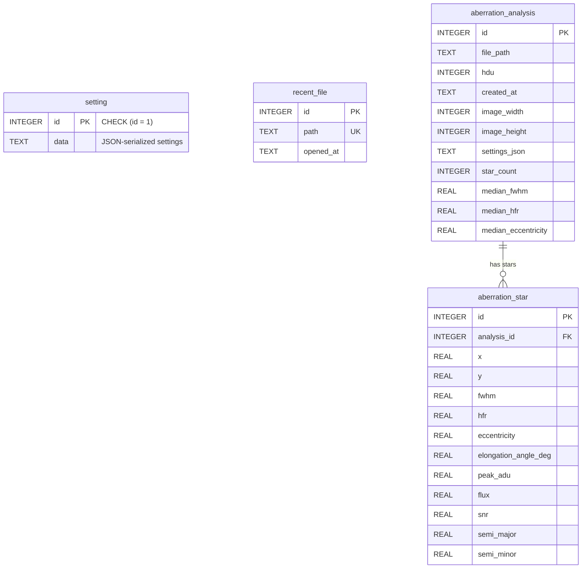

---

## 2. Lookup / Reference Tables

Shared reference data. All carry seed tracking columns (`created_at`, `updated_at`, `active`, `source`, `seed_key`, `seed_hash`) — omitted from diagram for readability.

```mermaid
erDiagram
    manufacturer {
        INTEGER id PK
        TEXT name UK
        TEXT website
        TEXT notes
    }

    optical_design {
        INTEGER id PK
        TEXT name UK
        TEXT description
    }

    mount_type {
        INTEGER id PK
        TEXT name UK
        TEXT description
    }

    connection_interface {
        INTEGER id PK
        TEXT name UK
        TEXT category "CHECK: data, control, power, wireless"
        TEXT notes
    }

    connector_size {
        INTEGER id PK
        TEXT name UK "M54, M48, T2, 2 inch, etc."
        REAL diameter_mm
        TEXT notes
    }

    filter_size {
        INTEGER id PK
        TEXT name UK "1.25 inch, 2 inch, 36mm, 50mm"
        TEXT description
    }

    computer_type {
        INTEGER id PK
        TEXT name UK "imaging, processing, control, general"
        TEXT description
    }

    filter_type {
        INTEGER id PK
        TEXT name UK "CHECK: 9 closed values"
        TEXT description
    }

    seed_loader_meta {
        TEXT key PK
        TEXT value
    }
```

`filter_type.name` is user-extensible (no CHECK constraint). Seed values: `luminance`, `broadband_color`, `narrowband_single`, `narrowband_dual`, `narrowband_tri`, `uv_ir_cut`, `light_pollution`, `neutral_density`, `other`.

---

## 3. Sensor

Sensor models shared across cameras. Many cameras use the same sensor (e.g., IMX571).

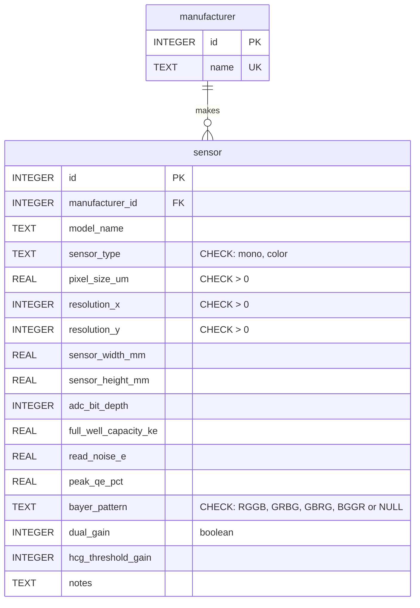

Constraint: `mono` sensors must have `bayer_pattern IS NULL`; `color` sensors must have `bayer_pattern IS NOT NULL`.

---

## 4. Camera

Imaging cameras reference sensor, manufacturer, connector size. Connection interfaces via junction table. USB hub modeled as boolean + optional interface FK.

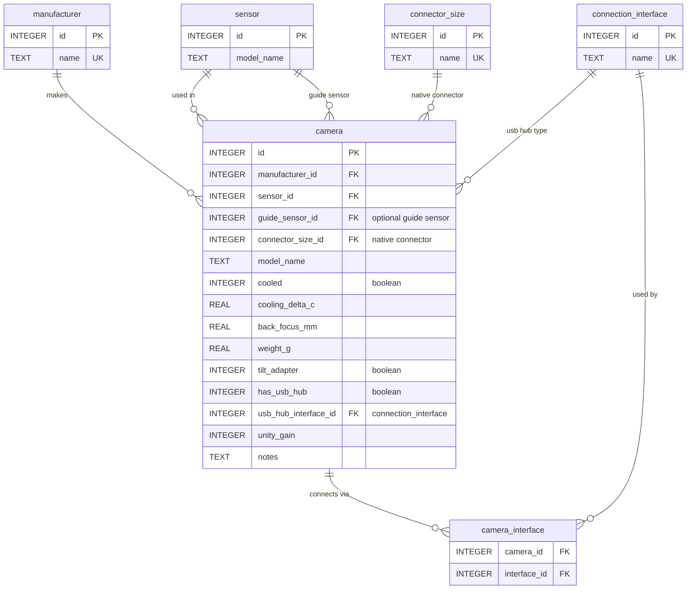

---

## 5. Telescope and Configuration

Base OTA carries only identity — aperture, optical design. All focal length/ratio/back_focus data lives on `telescope_configuration`. Every telescope must have at least one config with `is_native=1` (enforced by partial unique index).

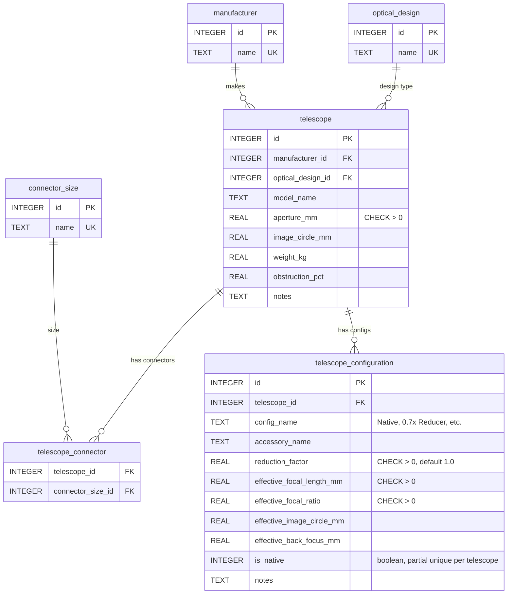

---

## 6. Filter and Passbands

`filter_type` describes the filter's role (narrowband_single, broadband_color, etc.). Wavelength data lives on `filter_passband` — one row for single-band, two for dual-band, three for tri-band.

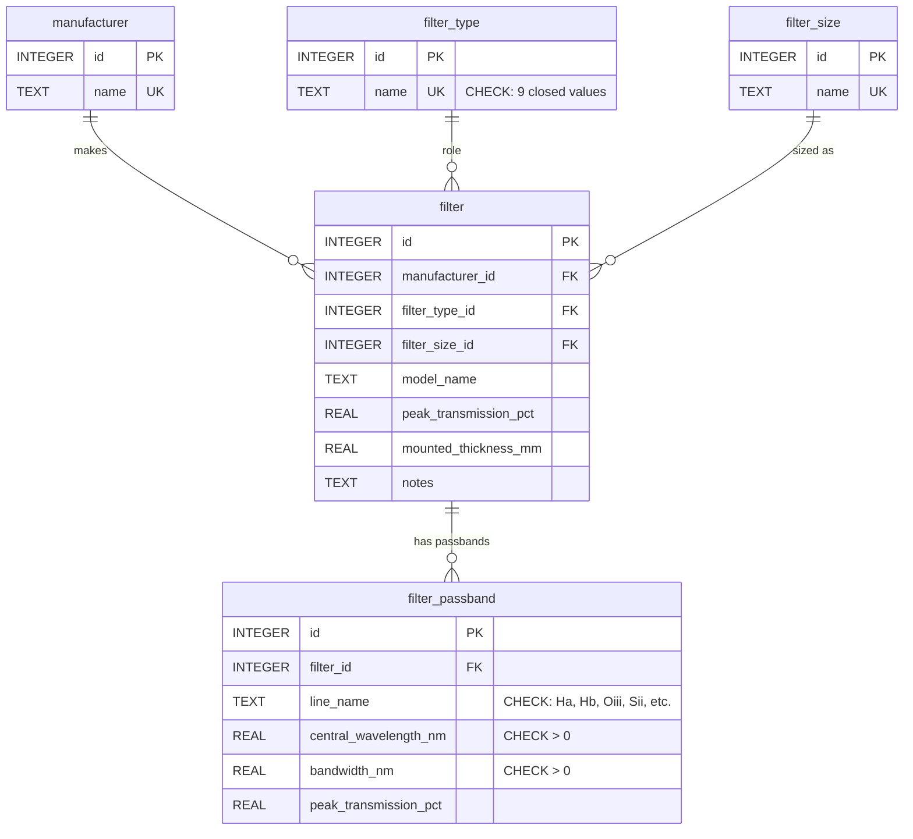

`filter_passband.line_name` CHECK: `Ha`, `Hb`, `Oiii`, `Sii`, `Nii`, `OI`, `Lum`, `R`, `G`, `B`, `UVIR`, `LP`, `ND`, `other`.

---

## 7. Mount

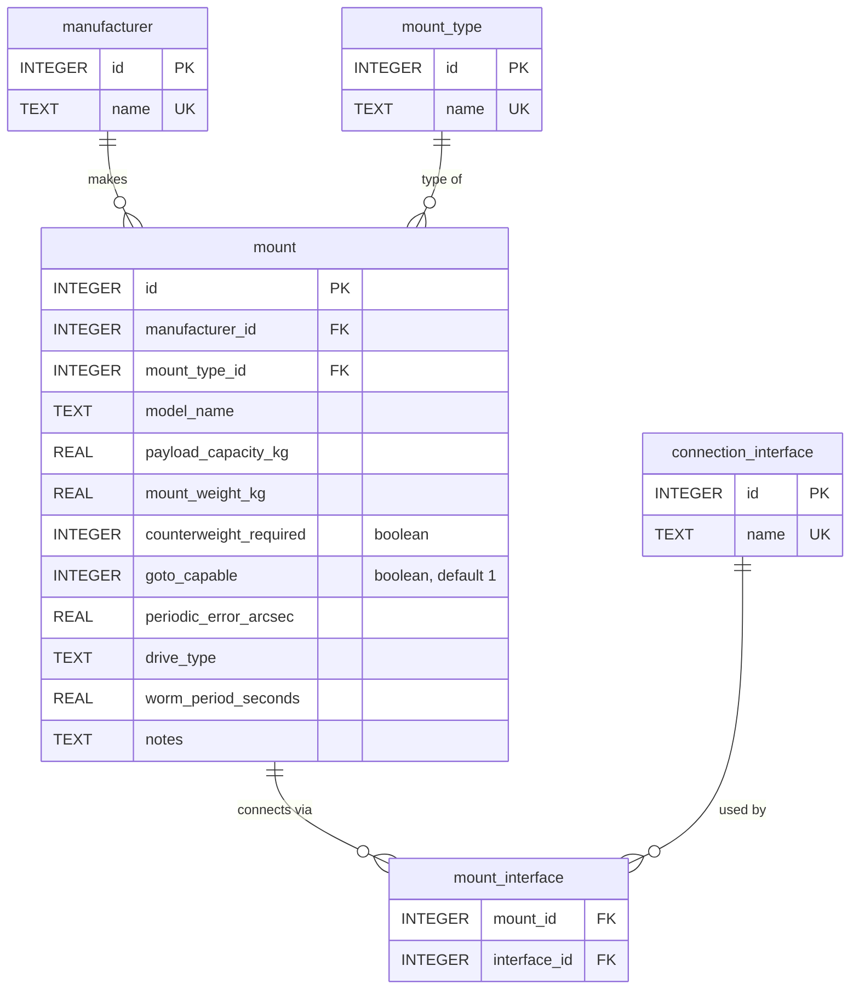

---

## 8. Focuser

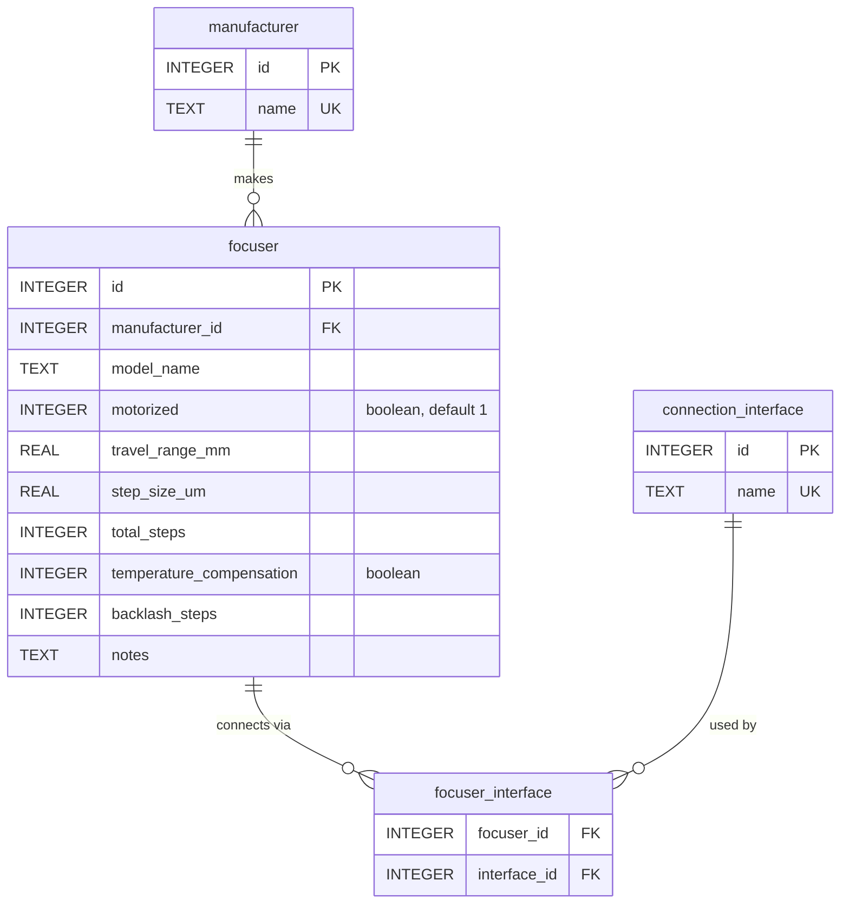

---

## 9. Filter Wheel

Connectors on both sides (camera side and telescope side). Accepts a specific filter size.

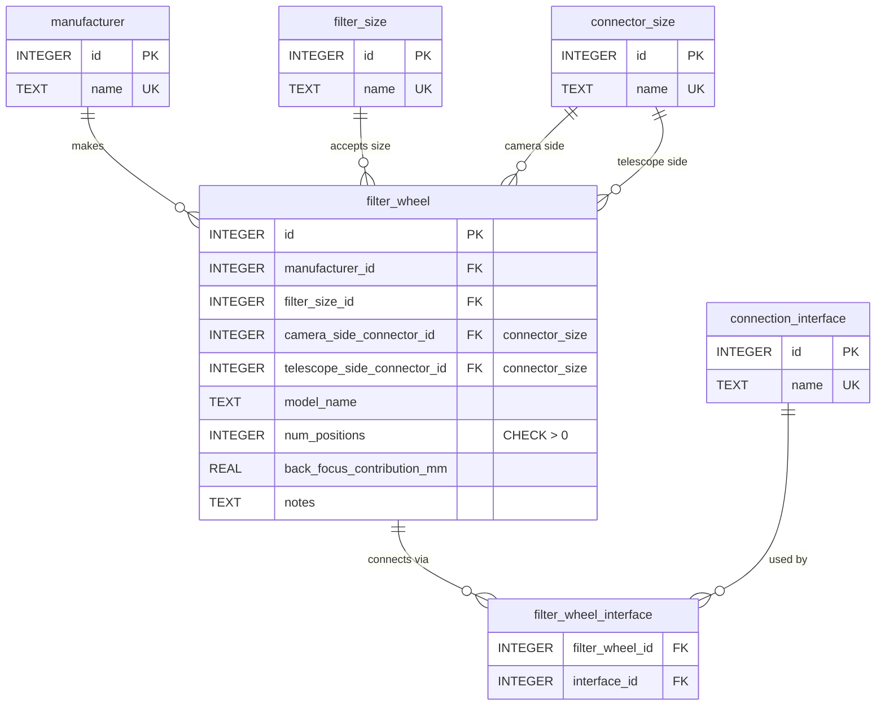

---

## 10. Guiding Equipment (OAG, Guide Scope)

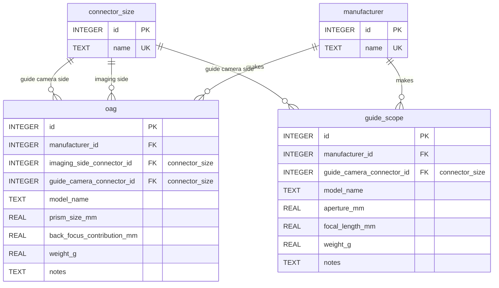

---

## 11. Computing and Software

`software.developer` replaced by `software.manufacturer_id` FK. Software category is a CHECK constraint.

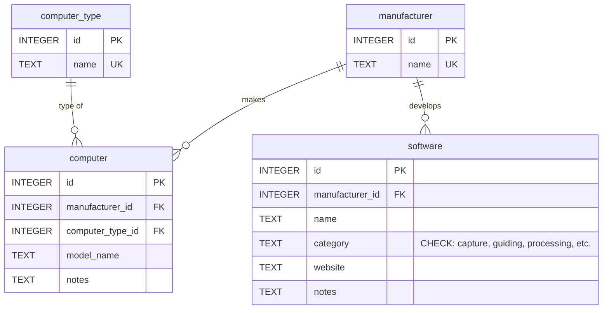

---

## 12. FITS Ingest Alias Tables

For auto-resolving FITS header values to equipment rows. Alias tables carry `source`, `confirmed`, and timestamp tracking. `unresolved_equipment_observation` records unknown header values pending user review.

---

## 13. Global Columns (on every equipment and lookup table)

Omitted from diagrams for readability. Every seedable table carries:

| Column | Type | Purpose |
|--------|------|---------|
| `created_at` | TEXT DEFAULT datetime('now') | Row creation timestamp |
| `updated_at` | TEXT DEFAULT datetime('now') | Last modification (auto-updated via trigger) |
| `active` | INTEGER DEFAULT 1 CHECK (0,1) | Soft retirement — 0 hides from dropdowns, preserves historical references |
| `source` | TEXT DEFAULT 'user' CHECK ('seed','user') | Whether row came from seed data or user |
| `seed_key` | TEXT (partial unique index) | Stable identifier for seed loader matching |
| `seed_hash` | TEXT | SHA-256 of seed-originated fields for change detection |

---

## 14. Imaging Core (v0.40.0)

The Sessions / Sub-Frames / Ingest schema (migration 0037). `sub_frame` is the core atom — lights, darks, flats, and bias all share it, distinguished by `frame_type`. `session` is the AUTO/ingest rig-night grouping (distinct from the MANUAL `project_session` of migration 0035). Several tables (`session_log_file`, `session_event`, `autofocus_run`, `guiding_log_file`, `guiding_sample`, `dither_event`) are created EMPTY here and populated by later versions (v0.43/0.44). `project` also gains a nullable `cover_sub_frame_id INTEGER REFERENCES sub_frame(id)`. **Migration 0040 reworked ownership:** `sub_frame`, `processed_image`, and `file_location` each gained `project_id NOT NULL` (CASCADE) and per-project identity (`UNIQUE(project_id, content_hash)` / `UNIQUE(project_id, path)`) — each project owns its own row for a file; the same physical file cataloged into two projects is two independent rows.

```mermaid
erDiagram
    project {
        INTEGER id PK
        INTEGER cover_sub_frame_id FK "v0.40.0 ALTER, nullable"
    }

    ingestion_run {
        INTEGER id PK
        INTEGER project_id FK
        TEXT source_path
        TEXT mode "CHECK: catalog_in_place, copy_and_organize, reparse"
        TEXT status "CHECK: running, completed, failed, cancelled"
        INTEGER files_scanned
        INTEGER subs_inserted
        TEXT started_at
        TEXT finished_at
    }

    session {
        INTEGER id PK
        INTEGER project_id FK
        INTEGER rig_id FK
        TEXT start_utc
        TEXT end_utc
        REAL latitude "CHECK -90..90"
        REAL longitude "CHECK -180..180"
        INTEGER bortle_class "CHECK 1..9"
    }

    processed_image {
        INTEGER id PK
        INTEGER project_id FK "NOT NULL, owns the row"
        TEXT content_hash "UNIQUE(project_id, content_hash)"
        TEXT image_kind "CHECK: master, stack, processed, other"
        TEXT frame_type "CHECK: light, dark, flat, bias, dark_flat, unknown"
        INTEGER filter_id FK
        TEXT line_name "CHECK: 15 bandpass values"
        INTEGER camera_id FK
        INTEGER ingestion_run_id FK
    }

    sub_frame {
        INTEGER id PK
        INTEGER project_id FK "NOT NULL, owns the row"
        TEXT content_hash "SHA-256; UNIQUE(project_id, content_hash)"
        INTEGER session_id FK "SET NULL"
        INTEGER rig_id FK
        INTEGER project_target_id FK "SET NULL"
        INTEGER ingestion_run_id FK "SET NULL"
        TEXT frame_type "CHECK: light, dark, flat, bias, dark_flat, unknown"
        INTEGER accepted "CHECK 0/1"
        INTEGER camera_id FK
        INTEGER filter_id FK
        REAL exposure_seconds "CHECK >= 0"
        REAL gain
        REAL set_temp_c
        TEXT date_obs_utc "NOT NULL (mtime fallback)"
        TEXT object_hint
        TEXT filter_name_hint
    }

    file_location {
        INTEGER id PK
        INTEGER project_id FK "NOT NULL, owns the row"
        TEXT path "UNIQUE(project_id, path)"
        TEXT category "CHECK: sub_frame, processed, pxiproject, log, other"
        INTEGER sub_frame_id FK "CASCADE"
        INTEGER processed_image_id FK "CASCADE"
        TEXT path_type "CHECK: original, working_copy, archive, ..."
        TEXT file_hash
        TEXT last_verified_status "CHECK: ok, missing, hash_mismatch, unreadable"
    }

    session_log_file {
        INTEGER id PK
        INTEGER session_id FK
        TEXT file_hash UK
        TEXT source "CHECK: nina, asiair, phd2, other"
        TEXT parse_status "CHECK: pending, parsed, failed, partial"
    }

    session_event {
        INTEGER id PK
        INTEGER session_id FK
        TEXT event_utc
        TEXT event_type "CHECK: 22 values"
        INTEGER related_sub_frame_id FK "SET NULL"
        INTEGER related_filter_id FK
    }

    autofocus_run {
        INTEGER id PK
        INTEGER session_id FK
        INTEGER filter_id FK
        INTEGER focuser_id FK
        REAL final_hfr
        TEXT source "CHECK: nina, asiair, manual, other"
    }

    guiding_log_file {
        INTEGER id PK
        INTEGER session_id FK
        TEXT file_hash UK
        INTEGER guide_camera_id FK
        INTEGER guide_scope_id FK
        INTEGER oag_id FK
        TEXT parse_status "CHECK: pending, parsed, failed, partial"
    }

    guiding_sample {
        INTEGER id PK
        INTEGER guiding_log_file_id FK "CASCADE"
        TEXT sample_utc
        REAL ra_error_arcsec
        REAL dec_error_arcsec
        REAL snr
    }

    dither_event {
        INTEGER id PK
        INTEGER guiding_log_file_id FK "CASCADE"
        TEXT dither_utc
        INTEGER settle_failed "CHECK 0/1"
    }

    project_source_folder {
        INTEGER id PK
        INTEGER project_id FK "CASCADE"
        TEXT path
        INTEGER is_primary "CHECK 0/1, one primary per project"
    }

    project ||--o{ ingestion_run : "ingested in"
    project ||--o{ session : "has"
    project ||--o{ processed_image : "has"
    project ||--o{ project_source_folder : "binds"
    rig ||--o{ session : "captured on"
    ingestion_run ||--o{ sub_frame : "produces"
    ingestion_run ||--o{ processed_image : "produces"
    session ||--o{ sub_frame : "groups"
    project_target ||--o{ sub_frame : "targets"
    sub_frame ||--o{ file_location : "located at"
    processed_image ||--o{ file_location : "located at"
    session ||--o{ session_log_file : "logged by"
    session ||--o{ session_event : "timeline"
    sub_frame ||--o{ session_event : "related to"
    session ||--o{ autofocus_run : "focused via"
    session ||--o{ guiding_log_file : "guided by"
    guiding_log_file ||--o{ guiding_sample : "samples"
    guiding_log_file ||--o{ dither_event : "dithers"
```

In addition, the migration creates calibration-matching and integration **views** (not tables): `matching_darks`, `matching_flats`, `matching_bias`, `calibration_coverage`, `integration_time_per_project_filter`, `project_filter_goal_progress`, and `session_summary`. See the Table Summary below and `DB_SCHEMA_DDL.sql` for the full definitions.

---

## Table Summary

### Existing Tables (v0.1.0–v0.7.0)

| Table | Purpose |
|-------|---------|
| `setting` | Single-row JSON application settings |
| `recent_file` | Recently opened file paths with timestamps |
| `aberration_analysis` | Cached star detection results per image |
| `aberration_star` | Individual star measurements linked to analysis |

### v0.8.0 — Lookup / Reference (9 + 1 meta)

| Table | Purpose |
|-------|---------|
| `manufacturer` | Brands — referenced by all equipment types |
| `optical_design` | Telescope optical types (SCT, APO, RC, etc.) |
| `mount_type` | Mount classifications (GEM, Harmonic EQ, etc.) |
| `connection_interface` | USB 2.0, WiFi, ST-4, etc. (with category) |
| `connector_size` | M54, M48, T2, 2 inch, etc. (with diameter_mm) |
| `filter_size` | 1.25", 2", 36mm, 50mm |
| `computer_type` | imaging, processing, control, general |
| `filter_type` | Closed vocabulary: 9 filter role values |
| `seed_loader_meta` | Key/value store for seed loader state |

### v0.8.0 — Equipment (11)

| Table | Purpose |
|-------|---------|
| `sensor` | Camera sensor models with specs |
| `camera` | Imaging cameras — refs sensor, manufacturer, connector |
| `telescope` | OTAs — identity only (aperture, design). No focal length. |
| `telescope_configuration` | Focal length/ratio/back_focus per reducer/extender variant |
| `filter` | Physical filters — refs filter_type, manufacturer, size |
| `filter_passband` | Wavelength bands per physical filter (1 for single, 2+ for dual/tri) |
| `mount` | Tracking mounts |
| `focuser` | Motorized/manual focusers |
| `filter_wheel` | Filter wheel housings with connectors on both sides |
| `oag` | Off-axis guiders |
| `guide_scope` | Guide scopes |
| `computer` | Imaging/processing computers |
| `software` | Applications (capture, guiding, processing, etc.) |

### v0.8.0 — Junction (5)

| Table | Purpose |
|-------|---------|
| `camera_interface` | Camera ↔ connection interface |
| `telescope_connector` | Telescope ↔ connector size |
| `mount_interface` | Mount ↔ connection interface |
| `focuser_interface` | Focuser ↔ connection interface |
| `filter_wheel_interface` | Filter wheel ↔ connection interface |

### v0.8.0 — FITS Alias (4)

| Table | Purpose |
|-------|---------|
| `camera_alias` | INSTRUME header → camera row |
| `telescope_alias` | TELESCOP header → telescope row |
| `filter_alias` | FILTER header → filter row |
| `unresolved_equipment_observation` | Unknown header values pending user review |

### v0.8.0 — Views (1)

| View | Purpose |
|------|---------|
| `filter_summary` | Aggregated filter + type + passbands with GROUP_CONCAT |

### Weather & Location Tables

| Table | Purpose |
|-------|---------|
| `location` | User-defined observing locations (lat/lon, elevation, display timezone, geo_timezone, Bortle, SQM, typical_seeing_low_arcsec, typical_seeing_high_arcsec). Soft-delete via `active=0` (migration 0012) — pre-empts future session-ingestion references. |
| `weather_cache` | Cached API responses (forecast, ECMWF PWV, AOD) with TTL-based expiry |

### v0.12.0 — Rigs (3 tables + 1 view)

| Table / View | Purpose |
|--------------|---------|
| `rig` | User-composed imaging rig: one `telescope_configuration_id` + one `camera_id` required; optional `mount_id`, `focuser_id`, `filter_wheel_id`, `single_filter_id`, `oag_id`, `guide_scope_id`, `guide_camera_id`, `computer_id`. Default-rig flag with single-active enforcement at the API layer. Soft delete via `active=0`. |
| `rig_filter_slot` | Filter wheel slot assignments (rig_id, slot_number, filter_id). `UNIQUE(rig_id, slot_number)`. Validated at API layer against `filter_wheel.num_positions`. |
| `rig_software` | Junction table: many-to-many between rigs and software packages (e.g. NINA + PHD2 + ASIAIR on the same rig). Primary key `(rig_id, software_id)`. |
| `rig_summary` (view) | Joins rig with equipment to expose headline specs and equipment names for list rendering. Includes `telescope_id` (added in migration 0010), guide camera sensor fields for calculator consumption, and `sensor_adc_bit_depth` (added in migration 0013) for the File Size calculator's auto-populate-from-rig flow. |

### v0.12.0 — "My Equipment" flag

`is_mine INTEGER NOT NULL DEFAULT 0 CHECK(is_mine IN (0,1))` added to 10 owned equipment tables (`camera`, `telescope`, `filter`, `mount`, `focuser`, `filter_wheel`, `oag`, `guide_scope`, `computer`, `software`) with a partial index `idx_<table>_mine ON <table>(is_mine) WHERE is_mine = 1` on each. Sensors, lookup tables, junction tables, child tables, and alias tables are not touched — sensors aren't owned standalone. The flag is not tracked by the seed loader's hash contract, so marking a seeded item as mine does not trigger re-seed.

### v0.13.0 — Custom Horizons (2 tables)

| Table | Purpose |
|-------|---------|
| `location_horizon` | **Multi-horizon per location (v0.19.0).** 1:N with `location` (no UNIQUE on location_id). Columns: `id`, `location_id` (FK CASCADE), `name`, `type` (`'custom'` or `'artificial'`, CHECK), `flat_altitude_deg` (NOT NULL when artificial, in `[-5, 90]`; NULL for custom), `source` (`'imported'|'drawn'|NULL`, only meaningful for custom), `source_filename`, `notes`, `is_default`, `created_at`, `updated_at`. Partial unique index `(location_id) WHERE is_default=1` enforces exactly-one-default per location. Partial unique index `(location_id) WHERE type='custom'` enforces at-most-one-custom. `UNIQUE(location_id, name)`. Reshaped in migration 0021 (`0014` created the original 1:1 table; `0021` drops + recreates it preserving data and seeds a `0° flat` artificial default for every location that had no horizon). |
| `location_horizon_point` | `(azimuth_deg, altitude_deg)` points for **custom** horizons only. Composite PK on `(horizon_id, azimuth_deg)`. CHECK on `azimuth_deg ∈ [0, 360)` and `altitude_deg ∈ [-5, 90]`. Points cascade-delete with the horizon. Index on `(horizon_id, azimuth_deg)` for ordered fetch. Recreated by migration 0021 with an FK that points at the new `location_horizon` (the original FK was rewritten by SQLite's ALTER-RENAME to reference the legacy table and would have been invalidated). |

### v0.14.0 — DSO Catalog (3 tables)

| Table | Purpose |
|-------|---------|
| `dso_catalog_source` | Loader registry — one row per source file (OpenNGC main + addendum for v0.14.0). Carries `file_hash` (sha256 used for idempotent reload), `category` CHECK ∈ `{'openngc','vizier','nightcrate','wikidata'}` (widened in migration 0022 to admit Wikidata SPARQL dumps), version, source URL, license, attribution, row_count. Created in migration 0015. |
| `dso` | Canonical DSO row. Denormalized `primary_designation` drives display. Closed CHECK vocabulary on `obj_type` (19 values + `'Other'` escape hatch preserving the upstream code in `raw_obj_type`). Coordinates (J2000), geometry, photometry (B/V/J/H/K + surface brightness), morphology (Hubble type, z, radial velocity, proper motion), planetary-nebula central-star columns, `raw_other_id` verbatim for future re-parse, editorial placeholders (`popularity_rank`, `difficulty`, `recommended_filter_id` FK → `filter`) unused in this pass. Indexes on `obj_type`, `constellation`, `primary_designation`, `source_catalog_id`. `updated_at` trigger. **v0.15.0 additions (migration 0016):** `distance_pc` (parsecs), `distance_method` (CHECK ∈ `{50mgc, curated, redshift}`, nullable; precedence is curated > 50 MGC > redshift, enforced structurally via `WHERE distance_pc IS NULL` in each augmenter), `common_name_augmented` and `surface_brightness_augmented` `{0,1}` provenance flags driving the UI "augmented" indicator. |
| `dso_designation` | Many-to-one: many designations per DSO. 29-prefix closed CHECK vocabulary on `catalog` (ngc, ic, messier, caldwell, ugc, pgc, mcg, eso, arp, hickson, sharpless2, barnard, ldn, lbn, vdb, cederblad, pk, rcw, gum, mrk, terzan, pal, mel, cr, stock, ruprecht, abell, dolidze, dwb). `UNIQUE(catalog, identifier)` — the same designation cannot point to two DSOs. Partial unique index enforces one `is_primary = 1` per DSO. `search_key` column (lowercase + whitespace/dash-stripped display form) powers fast designation lookup. |
| `thumbnail_cache` (v0.16.0 migration 0017, extended by v0.17.0 migrations 0018 + 0019) | Target Planner LRU thumbnail cache metadata. Files live on disk under `APP_DIR/thumbnails/`. Rows carry `dso_id` FK (cascade-delete), `variant` (`list`/`detail`/`rig_framed`/`fov_simulator`), dimensions, nullable `fov_major_deg_x1000` / `fov_minor_deg_x1000` for rig-dependent variants, nullable `center_ra_deg_x1000` / `center_dec_deg_x1000` for panned `fov_simulator` tiles at arbitrary sky centres (NULL = pin to DSO native coords), absolute `file_path`, `source` (`dss2_color`/`dss2_red`/`dss2_blue`/`placeholder`), `bytes`, `fetched_at`, `last_access_at`, and a nullable `fetch_error` (non-null rows are backoff sentinels that expire after 1 hour). Unique index spans `dso_id, variant, width, height, COALESCE(fov_major_deg_x1000, -1), COALESCE(fov_minor_deg_x1000, -1), COALESCE(center_ra_deg_x1000, -999999), COALESCE(center_dec_deg_x1000, -999999)` — distinct sentinels keep NULL separate from legitimate 0.0 RA. Index on `last_access_at` drives LRU eviction. Migration 0018 rebuilds the table (Pass A `detail` entries are wiped); 0019 ALTER-adds the centre columns + rebuilds the unique index — an app-startup orphan sweep deletes any now-stale on-disk JPEGs. **v0.18.0:** the `fov_simulator` variant is retired — the simulator now pulls from the DSO-agnostic `sky_tile_cache` table below. The `center_*_x1000` columns become vestigial for the simulator path (other variants default NULL). |

### v0.18.0 — Target Planner Pass C Sky-Tile Cache (1 table)

| Table | Purpose |
|-------|---------|
| `sky_tile_cache` (migration 0020) | DSO-agnostic tile cache for the FOV Simulator and DSO-catalog auto-zoom previews. Cells are keyed by `(hips_survey, healpix_nside, healpix_ipix, tier, cell_size_deg_x100, cell_width_px, cell_height_px, cell_i, cell_j)` — no FK to `dso`. NSIDE=8 partitions the sphere into 768 equal-area HEALPix regions; every cell in a region shares the region's tangent plane and tiles pixel-perfectly at shared edges. `tier` CHECK ∈ `{'narrow','med','wide'}` selects one of three resolution steps from the rig's major FOV. `source` CHECK ∈ `{'dss2_color','dss2_red','dss2_blue','placeholder'}`. Stores `file_path`, `bytes`, `fetched_at`, `last_access_at`, and a nullable `fetch_error` (same 1-hour backoff semantics as `thumbnail_cache`). Unique index spans the full key; additional indexes on `last_access_at` (LRU) and `(healpix_nside, healpix_ipix)` (region lookups). Two DSOs whose composites overlap inside a region share every cell in the overlap — the defining performance win over the DSO-keyed `thumbnail_cache`. |

### v0.20.0 — DSO External References (1 table; v0.21.1 widens provider CHECK)

| Table | Purpose |
|-------|---------|
| `dso_external_ref` (migrations 0022 + 0023) | Associates Wikidata QIDs, Wikipedia article URLs, SIMBAD cross-references, and NED galaxy-DB links with canonical DSOs. Columns: `dso_id` (FK CASCADE), `provider` (CHECK ∈ `{'wikidata','wikipedia','simbad','ned'}` after migration 0023), nullable `language` (required for wikipedia, forbidden for the three language-agnostic providers — enforced in loader code), `identifier` (QID / article slug / SIMBAD ID / primary designation), `url`, `label`, optional `source_catalog_id`, `created_at`, `updated_at` (with trigger). `UNIQUE(dso_id, provider, language)` enforces one row per DSO per provider per language; a partial unique index `(dso_id, provider) WHERE language IS NULL` covers the language-agnostic case (SQLite treats NULLs as distinct in the main unique index). No global uniqueness on `(provider, language, identifier)` — a single resource may legitimately span multiple DSOs (Stephan's Quintet article = 5 galaxies; Crab Nebula Wikidata QID = NGC 1952 + Sh2-244). Populated by `catalog_loader/wikidata_loader.py` (bulk SPARQL fetch — Wikipedia + Wikidata + SIMBAD from P3083; NED synthesised from primary_designation gated by `GALAXY_TYPES`) and `catalog_loader/external_refs_loader.py` (editorial CSV overrides — precedence "later wins"). |

### v0.35.0 — Projects (2 tables)

| Table | Purpose |
|-------|---------|
| `project` (migrations 0029, 0031) | User-defined imaging project. `name` (NOT unique — migration 0031 allows duplicate project names), `description`, `notes`, `status` CHECK ∈ `{'active','paused','complete','abandoned'}`, `active` soft-delete flag, timestamps with `updated_at` trigger. Index on `active`. |
| `project_image` (migrations 0029, 0033) | File reference within a project. `project_id` FK CASCADE, `file_path` (supports `::` virtual paths for archives and pxiprojects), `display_order`, `is_main` with partial unique index enforcing at most one main per project, `notes`, timestamps with trigger. Index on `project_id`. (v0.37.0 / migration 0033 dropped the `staged` column — the project editor moved to save-as-you-go: edits persist immediately, no Save/Cancel.) |

### v0.36.0 — Project Thumbnails (1 table)

| Table | Purpose |
|-------|---------|
| `project_thumbnail` (migration 0032) | Per-project, per-size crop definitions for thumbnail generation. `project_id` FK CASCADE, `size` CHECK ('small', 'medium', 'large'), `source_image_id` FK to project_image (ON DELETE SET NULL), crop rectangle as fractions 0-1 (`crop_x`, `crop_y`, `crop_w`, `crop_h`), UNIQUE (project_id, size). Cropped thumbnails stored on disk at `{project_dir}/thumb_crop_{size}.jpg`. |

### v0.37.0 — Project Plate Solve + DSO Links (2 tables)

| Table | Purpose |
|-------|---------|
| `project_solve` (migration 0034) | One plate solve per project (`project_id` FK CASCADE `UNIQUE`) of a **standalone** non-gallery image. Stores `image_path`, `image_width`/`image_height`, the WCS solution (`center_ra_deg`/`center_dec_deg` = ASTAP CRVAL, full CD matrix, `crpix1`/`crpix2`) and display fields (`ra_hms`, `dec_dms`, `pixel_scale_arcsec`, `rotation_deg`, `fov_width_arcmin`, `fov_height_arcmin`), `solved_at`. View-only; delete to re-solve. Index on `project_id`. |
| `project_dso` (migration 0034) | Catalog objects found in a solved frame. `solve_id` FK CASCADE, `dso_id` FK CASCADE, `is_main` (vestigial — v0.38.0 derives is_main from `project_target` instead; this column is no longer authoritative), `created_at`, `UNIQUE(solve_id, dso_id)`. **Every** in-FOV object is stored (not just mains) to power a future cross-project DSO search; one is auto-flagged main (nearest frame centre, tie-break largest). Deleting the solve cascades these rows. Indexes on `solve_id` and `dso_id`. |
| `project_rig` (migration 0035, v0.38.0) | Multi-rig project association. `project_id` FK CASCADE, `rig_id` FK, PRIMARY KEY (both). Indexes on each column. Supports dual-rig projects. |
| `project.location_id` (migration 0035, v0.38.0) | ALTER ADDed nullable `INTEGER REFERENCES location(id)` on `project`. No CASCADE: locations soft-delete; the row is preserved so references stay valid. |
| `project_session` (migration 0035, v0.38.0) | Manually-entered capture batch (N identical light subs of one filter). `project_id` FK CASCADE, optional `rig_id`, **`filter_id` OR `line_name`** (CHECK enforced), `exposure_seconds > 0`, `gain` (nullable), `num_subs > 0`, `binning` (nullable), `session_date` (nullable; date or ISO datetime), `notes`, `source` ('manual' \| 'auto'), timestamps with trigger. Derived integration in `api/project_sessions.py:_compute_integration` expands filter_id sessions through `filter_passband` (duo-band double-counts; spec §12). The v0.39.0 ingest pipeline will write to this table with `source='auto'`. |
| `project_filter_goal` (migration 0035, v0.38.0) | Per-filter integration goal. `project_id` FK CASCADE, `line_name` CHECK (same 15-value vocab as `filter_passband.line_name`), `goal_minutes > 0`, UNIQUE per `(project_id, line_name)`. Drives the per-line goal marker on the Overview's integration bar chart. |
| `project_target` (migration 0036, v0.38.0) | **Persistent project↔dso link** — the single source of truth for "main targets". `project_id` FK CASCADE, `dso_id` FK CASCADE, UNIQUE per `(project_id, dso_id)`. Migration 0036 backfills from existing `project_dso.is_main = 1` rows. Creating a plate solve auto-inserts its best-guess main here; toggling the star on either the Overview or Plate Solve tab edits the same record. **`project_target` rows survive `DELETE /solve`** (cascade is on project, not solve). Indexes on each column. |

### v0.40.0 — Imaging Core (12 tables + 1 ALTER + 7 views, migration 0037)

| Table | Purpose |
|-------|---------|
| `ingestion_run` | One row per catalog/ingest pass. `project_id` FK CASCADE, `source_path`, `mode` CHECK (`catalog_in_place`/`copy_and_organize`/`reparse`), `status` CHECK (`running`/`completed`/`failed`/`cancelled`), running counters (`files_scanned`, `subs_inserted`, `subs_updated`, `subs_skipped`, `errors_count`), `errors_json`, `started_at`/`finished_at`. Provenance for every sub_frame / processed_image (§11). |
| `session` | **AUTO/ingest rig-night grouping** of sub frames (distinct from the MANUAL `project_session`). `project_id` FK CASCADE, `rig_id` FK, `start_utc` (NOT NULL)/`end_utc`, site fields (`site_name`, `latitude` CHECK ±90, `longitude` CHECK ±180, `elevation_m`, `bortle_class` CHECK 1–9), `conditions_notes`, timestamps with `updated_at` trigger. Indexes on project, rig, start (§5). |
| `processed_image` | Stacks / masters / finished images promoted to first-class. `project_id` FK NOT NULL CASCADE (each project owns its row — migration 0040), `UNIQUE(project_id, content_hash)`, `image_kind` CHECK (`master`/`stack`/`processed`/`other`), nullable `frame_type` + `line_name` (15-value vocab) + `filter_id`/`camera_id`/`telescope_id` FKs, `ncombine`, `total_exposure_seconds` (migration 0039 — integration time for masters), `date_obs_utc`, dimensions, `fits_header_json`, `ingestion_run_id` FK SET NULL, timestamps with trigger. |
| `sub_frame` | **The core atom** — lights, darks, flats, bias share this table via `frame_type` CHECK (`light`/`dark`/`flat`/`bias`/`dark_flat`/`unknown`). `project_id` FK NOT NULL CASCADE (each project owns its row — migration 0040); `UNIQUE(project_id, content_hash)` (SHA-256, idempotent re-ingest *per project*). Nullable grouping FKs: `session_id` (SET NULL), `rig_id`, `project_target_id` (SET NULL), `ingestion_run_id` (SET NULL). `accepted` 0/1 + `rejection_reason`/`rejection_source` CHECK. Nullable equipment FKs (camera, telescope, telescope_configuration, filter, mount, filter_wheel, focuser). Capture settings (`exposure_seconds` CHECK ≥ 0 — bias may be ~0, gain, offset_adu, temps, binning, bit_depth, dimensions). `date_obs_utc` NOT NULL (mtime fallback) + `obs_mjd`. Pointing (ra/dec/rotation/pixel_scale/airmass). Quality metrics (hfr, star_count, …; NULL in v0.40.0). Denormalized site. `object_hint`/`filter_name_hint` (raw headers, kept so lights catalog before filter_id resolves in v0.41.0) + `fits_header_json`. Timestamps with trigger. **No light-needs-filter CHECK** — ingest must never fail on partial equipment. Many single + four partial composite calibration-match indexes (§6). |
| `file_location` | One row per cataloged file (any category), optionally linked to the sub_frame / processed_image it represents (multiple rows may share a sub_frame). `project_id` FK NOT NULL CASCADE (each project owns its row — migration 0040), `UNIQUE(project_id, path)`, `category` CHECK (`sub_frame`/`processed`/`pxiproject`/`log`/`other`), `sub_frame_id`/`processed_image_id` FKs CASCADE, `path_type` CHECK, `volume_label`, `size_bytes`, `file_hash`, `mtime`, `last_verified_at`/`last_verified_status` CHECK (`ok`/`missing`/`hash_mismatch`/`unreadable`) (§10). |
| `session_log_file` | **Empty in v0.40.0** (parsed v0.44.0). `session_id` FK CASCADE, `file_hash` UNIQUE, `path`, `source` CHECK (`nina`/`asiair`/`phd2`/`other`), covered start/end UTC, `parse_status` CHECK, `parse_error`, `raw_text` BLOB. |
| `session_event` | **Empty in v0.40.0** (v0.44.0). Session timeline event. `session_id` FK CASCADE, `event_utc`, `event_type` CHECK (22 values: session/slew/plate_solve/filter_change/exposure/autofocus/dither/meridian_flip/guiding/cooling/error/…), `event_data_json`, `related_sub_frame_id` FK SET NULL, `related_filter_id` FK. Index on (session, event_utc) + type. |
| `autofocus_run` | **Empty in v0.40.0** (v0.44.0). `session_id` FK CASCADE, `filter_id`/`focuser_id` FKs, triggered/completed UTC, `temperature_c`, initial/final position + hfr, `success` 0/1, `trigger_reason` CHECK, `source` CHECK, `raw_json` (§9). |
| `guiding_log_file` | **Empty in v0.40.0** (PHD2 parse v0.43.0). `session_id` FK CASCADE, `file_hash` UNIQUE, `path`, start/end UTC, `guide_camera_id`/`guide_scope_id`/`oag_id` FKs, `guide_pixel_scale_arcsec`, `parse_status` CHECK (§8). |
| `guiding_sample` | **Empty in v0.40.0** (v0.43.0). `guiding_log_file_id` FK CASCADE, `sample_utc`, RA/Dec error + correction (arcsec), `snr`, `star_mass`, `frame_number`. Index on (log_file, sample_utc) for per-sub time-range RMS lookups (§8/§14). |
| `dither_event` | **Empty in v0.40.0** (v0.43.0). `guiding_log_file_id` FK CASCADE, `dither_utc`, RA/Dec offset arcsec, `settle_completed_utc`, `settle_failed` 0/1. |
| `project_source_folder` | Project ↔ source-folder binding. `project_id` FK CASCADE, `path`, `is_primary` 0/1 with partial unique index enforcing at most one primary per project, `UNIQUE(project_id, path)`, `added_at`. |
| `project.cover_sub_frame_id` | ALTER ADDed nullable `INTEGER REFERENCES sub_frame(id)` on `project` — deferred back-reference resolved now that `sub_frame` exists. |

### v0.40.0 — Imaging Core Views (7)

| View | Purpose |
|------|---------|
| `matching_darks` | `(light_id, dark_id)` pairs: dark matches light on camera + gain + exposure + binning, with set_temp within ±1.0 °C (never on filter). Both sides `accepted = 1`. |
| `matching_flats` | `(light_id, flat_id)` pairs: flat matches on camera + gain + filter + binning + telescope_configuration (optical-train state matters). Both sides accepted. |
| `matching_bias` | `(light_id, bias_id)` pairs: bias matches on camera + gain + binning. Both sides accepted. |
| `calibration_coverage` | Per accepted light: `has_dark`/`has_flat`/`has_bias` (1/0) via EXISTS over the three match views. |
| `integration_time_per_project_filter` | Integration grouped by project / target / `line_name` (joined through `filter_passband`, `active = 1`); a duo/tri-band filter intentionally double-counts one row per line. Sums seconds/minutes/hours + sub_count over accepted lights. |
| `project_filter_goal_progress` | Per-project per-line goal vs actual (NULL-safe): joins `project_filter_goal` (keyed `project_id, line_name`) to the integration view; emits `goal_minutes`, `actual_minutes`, `completion_ratio`. |
| `session_summary` | Per-session rollup: duration_hours, total_subs, accepted/rejected lights, accepted_light_minutes, distinct targets/filters. |
