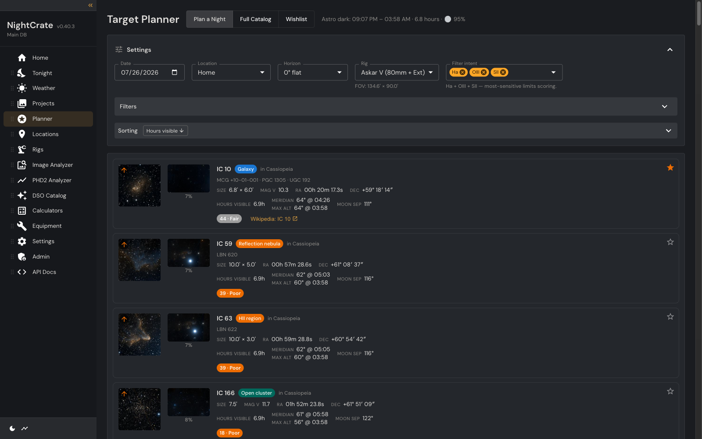
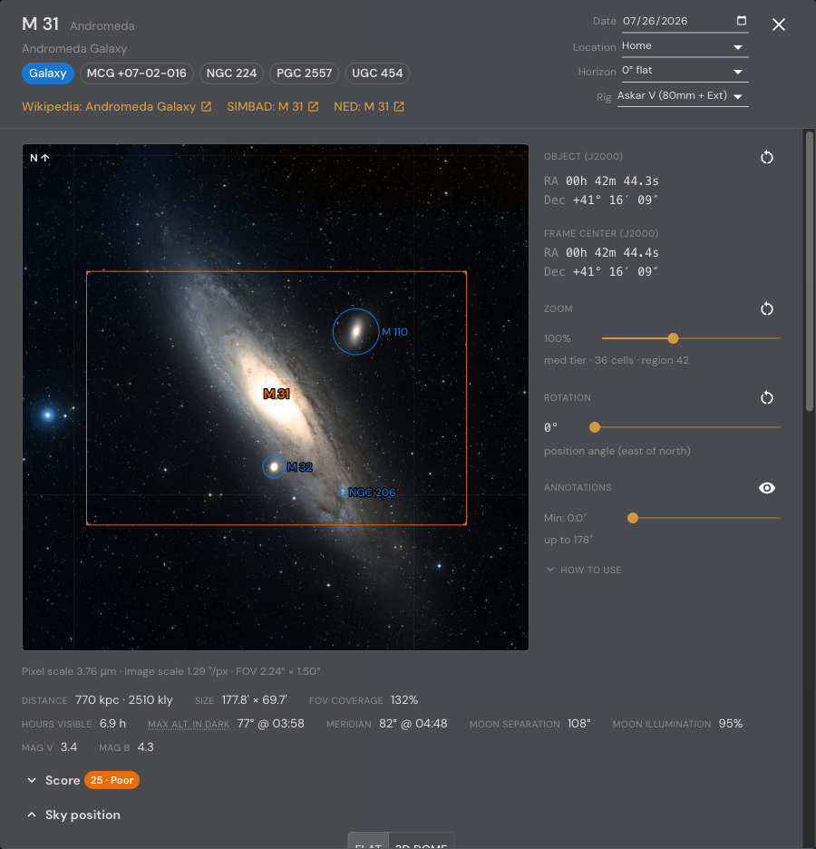
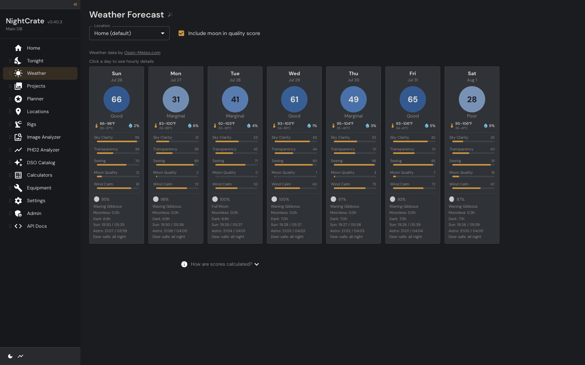
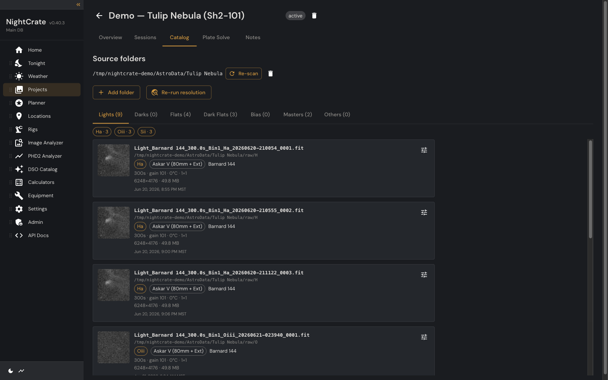
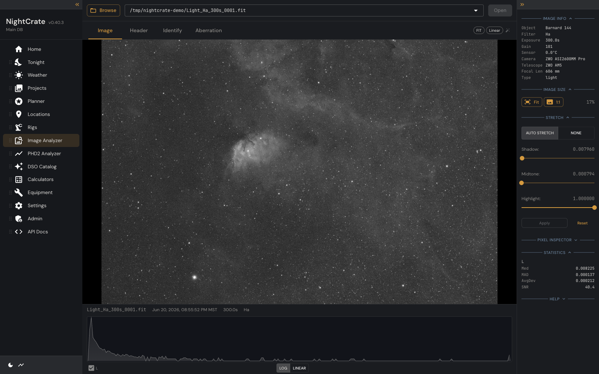
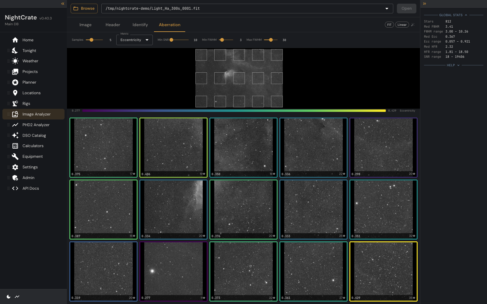
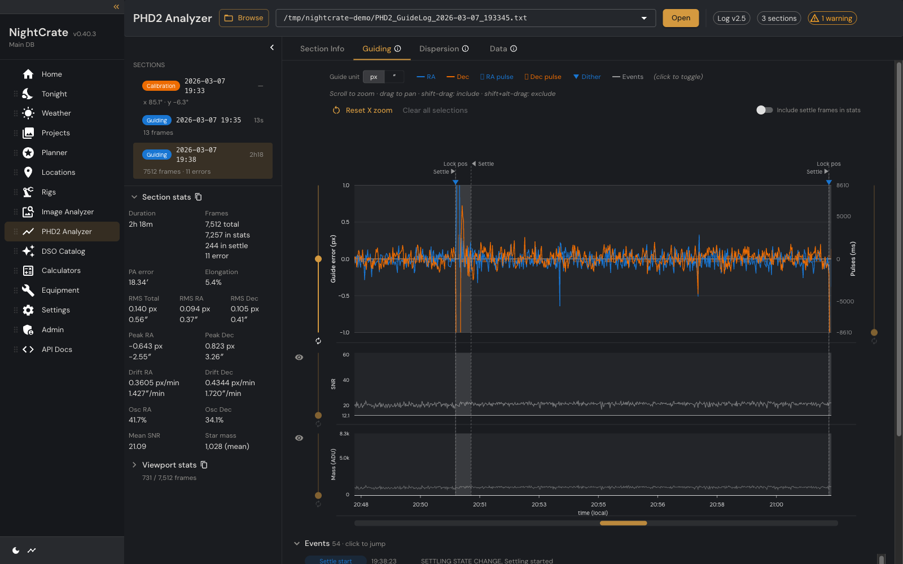
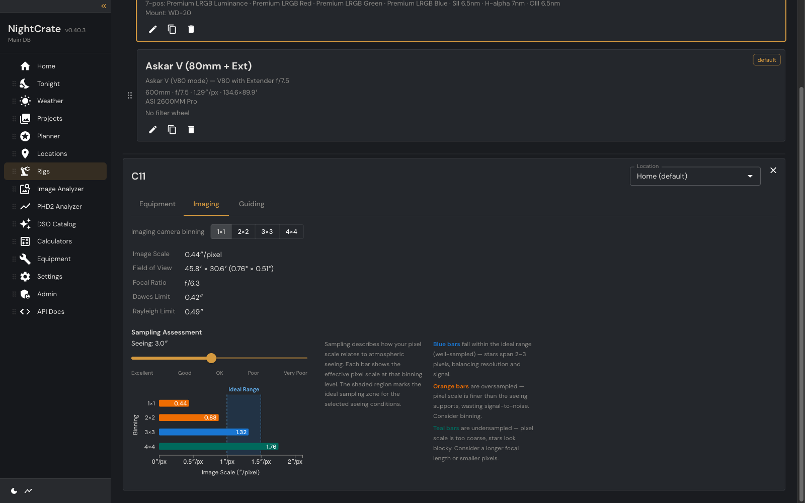

# NightCrate

**A local-first desktop app for serious amateur astrophotographers — plan the
night, judge the conditions, catalog what you shot, and analyze it afterwards.**

NightCrate sits in the gap between capture software (N.I.N.A., ASIAIR) and
processing software (PixInsight). It reads the artifacts your rig already
produces — FITS headers, PHD2 guide logs, your equipment inventory — and turns
them into a searchable catalog plus the analysis tools that catalog makes
possible.

Everything runs on your machine. No account, no cloud, no telemetry: a Python
backend bound to `127.0.0.1` serving a React UI in your browser.



## Why it exists

Plenty of tools do one of these things well. Nothing combines them. Telescopius
plans targets but knows nothing about your subs; PixInsight processes frames but
won't tell you which nights guided badly; a spreadsheet tracks integration time
but can't tell you that your 3nm Ha filter makes a 95%-illuminated moon
survivable.

NightCrate's bet is that the value is in the **joins** — guiding quality ↔
sub-frame quality ↔ equipment ↔ conditions ↔ target. It's also Mac-first in a
Windows-dominated ecosystem, while still running on Windows and Linux.

It's free, MIT-licensed, and built for a community that's underserved by
existing software.

---

## What it does

### Plan a night

A location-aware planner over the whole deep-sky catalog. For any date it
computes alt/az tracks at 5-minute resolution across astronomical darkness,
filters to what's actually visible above your horizon, and scores each target
0–100 on four dimensions: observability (altitude-weighted hours), meridian
timing, moon impact, and how well the object fits your sensor. Every weight and
threshold is user-tunable, and the detail panel shows the full breakdown rather
than a black-box number.

- **Moon modeling** that separates sky glow from proximity, and weights both by
  the filters you actually intend to use — a 3nm narrowband night and an LRGB
  night get different answers.
- **Horizons** per location: import from N.I.N.A. `.hrz`, Theodolite, Telescopius
  or APCC, or draw your own; plus any number of named flat-altitude horizons.
- **Wishlist + calendar** for bookmarking targets, grouping them into sections,
  and laying out planned imaging windows across the year.
- **FOV simulator** — drag to rotate your sensor rectangle over a real sky
  survey image, with catalog annotations projected onto the same tangent plane.



### Judge the conditions

A seven-night imaging-quality forecast, not a generic weather widget. Each night
gets a composite 0–100 score from sky clarity, seeing, transparency, moon, and
wind — with cloud cover gating everything else, because a perfect seeing forecast
under overcast is worth nothing.

Seeing is estimated from blended surface and wind-shear models; transparency
from precipitable water vapor, aerosol optical depth, humidity and visibility;
dew risk from the temperature–dew-point spread with a safe-window calculation.
Hourly detail joins the astronomical night to the weather by absolute UTC, so
the numbers stay correct even when a remote site's display timezone differs from
its geographic one. Data comes from Open-Meteo.



### Catalog what you shot

Point a project at one or more source folders and NightCrate walks them,
parses every FITS header in a process pool, and catalogs each file **in place**
— nothing is moved or renamed.

- **Classification comes from headers, never folder names.** `IMAGETYP` drives
  frame type; `NCOMBINE`/`STACKCNT`/PixInsight history identify masters and
  stacks. Dark-flats — which ASIAIR labels indistinguishably as plain darks —
  are inferred afterwards by matching their exposure to a flat rather than a
  light.
- **Equipment resolution.** Raw `INSTRUME`/`TELESCOP`/`FILTER` strings resolve to
  real equipment rows through a deterministic alias table (exact match after
  Unicode normalization — no fuzzy guessing, ever). Unrecognized strings land in
  a review queue on the Admin page; promoting one to an alias is always a human
  decision.
- **Rig attribution by elimination.** Camera, focal length and filter loadout
  each rule out candidate rigs; if exactly one survives, the frame is attributed
  — otherwise it's left null rather than guessed. Two identical camera bodies on
  two rigs are disambiguated this way. Any field can be overridden per frame, and
  your overrides survive every subsequent re-scan.
- **Sessions** group frames into observing nights (noon-to-noon in the site's
  own timezone), split per rig so a dual-rig night never conflates.
- Re-scanning is idempotent — identity is `(project, content hash)`, so counts
  never drift.

Each project also carries its own metadata: main targets, location, rigs, a
markdown notes tab, an image gallery with per-size crops, a plate solve that
persists every in-FOV catalog object, manually entered capture sessions, and
per-filter integration goals charted against actuals.



### Inspect any frame

A full image analyzer for FITS, XISF, PixInsight projects (`.pxiproject`), PNG,
JPEG and TIFF — including everything inside a `.zip`, `.7z` or
`.tar[.gz|.bz2|.xz|.zst]` archive, without unpacking the whole thing first.

- PixInsight-compatible **auto-stretch** (AutoSTF, computed server-side), with
  manual shadow/midtone/highlight override.
- Per-channel **statistics**, a log/linear **histogram**, and a **pixel
  inspector** with magnifier, hex value and named-color readout.
- **FITS header viewing and editing** with structural-keyword protection.
- **Identify**: detect WCS from headers — including reconstructing it from a
  PixInsight-solved XISF's astrometric solution — or plate solve on the spot,
  then overlay catalog objects with a sortable object grid.
- GPU-accelerated stretch and statistics via mlx (Apple Silicon) or CuPy, with a
  numpy fallback.
- Full touch support: pinch-zoom, pan, and long-press pixel inspection on iPad.



The **Aberration Inspector** measures star shape across a configurable sample
grid — FWHM, eccentricity, HFR per tile — so tilt, backfocus error and field
curvature show up as a spatial pattern instead of a hunch. Grid squares are
draggable, and results are cached.



### Diagnose your guiding

A PHD2 guide-log analyzer built to replace the "post your log to the forum and
wait for an expert" workflow.

The parser is format-tolerant by design (ASIAIR's blank version field, irregular
header separators, varying column counts, DROP frames, locale decimals,
backward timestamp jumps) and reads columns **by name**, never by position.
Missing values stay missing — never coerced to zero, which would fabricate
stretches of perfect guiding.

Metrics reproduce PHD2's own `AnalysisWin` formulas: population-standard-deviation
RMS, corrections-subtracted RA drift, unguided-frames-only Dec drift, polar
alignment error in arcminutes. Dither settle windows are excluded from quality
stats so a deliberate excursion doesn't inflate your peak. Three tabs — Guiding
(RA/Dec traces with pulses, SNR and star mass sub-panels), Dispersion (scatter
with 1σ/2σ ellipses), and a per-frame Data table. Shift-drag to accumulate
selection ranges, and export the visible window back out as a PHD2-format log.



### Model your gear

A fully normalized equipment database — cameras, sensors, OTAs (with multiple
optical configurations each), filters and passbands, mounts, focusers, filter
wheels, OAGs, guide scopes, computers, software — seeded from bundled reference
CSVs and extendable with your own. Mark what you own; retire rather than delete.

Compose those parts into **rigs**, then get real numbers out of them: image
scale, field of view, Dawes and Rayleigh limits, sensor coverage, sampling
assessment against a seeing slider, guide-system suitability (mode-aware for
guide scope vs OAG), and guiding tolerance expressed against your main scale.
Every calculator shows its formula and sources.



### Reference data and utilities

- **DSO catalog** — ~14,000 objects assembled from OpenNGC, Sharpless 2, Barnard
  and the 50 MGC distance catalog, with layered distance sourcing (curated >
  50 MGC > redshift-derived) and outbound links to Wikipedia, SIMBAD and NED. No
  catalog data ships in this repo; it downloads on demand from Admin → Catalogs.
- **Plate solving** via ASTAP as an external process (never with `-update`, so
  your files are never modified). Coordinate and FOV hints come from headers, a
  target search, or a selected rig.
- **Calculators** — 12 of them plus a Tonight-at-a-Glance summary: lat/long
  conversion, RA/Dec ↔ alt/az, sidereal and Julian clocks, angular and linear
  units, pixel scale, field of view, file size, airmass, moon altitude across a
  year, SQM/Bortle/NELM, temperature. The math lives server-side, so it's
  equally usable from any HTTP client.
- **Locations** with coordinates, timezone (geographic and display, kept
  separate), elevation, Bortle class and SQM.
- **Admin** — multiple workspaces (each a portable folder holding its own
  database and rendered images), cache budgets, catalog downloads, the equipment
  alias review queue, and an Activity Console that traces every request the UI
  makes.
- **API docs** — the whole backend is a documented OpenAPI surface, browsable
  in-app or at `/docs`.

---

## Running it

**Prerequisites:** Python 3.14 with [uv](https://docs.astral.sh/uv/), Node 20.19+
(or 22.12+), and optionally [ASTAP](https://www.hnsky.org/astap.htm) plus a star
database if you want plate solving.

```bash
make install    # uv sync + npm install
make dev        # backend on :8000, frontend on :5173, browser opens
```

On first run a setup wizard asks where to put your workspace — a folder holding
`nightcrate.db` and a `project_data/` directory. It's self-contained and
portable; you can register several and switch between them.

Other useful targets:

```bash
make backend    # backend only
make frontend   # frontend only
make dev-lan    # serve over HTTPS on the LAN (for tablet access)
make test       # pytest
make lint       # ruff
```

## Stack

- **Backend:** Python 3.14 · FastAPI · SQLite via `aiosqlite` (raw SQL, no ORM) ·
  Pydantic · yoyo-migrations
- **Frontend:** React 19 · TypeScript · Vite · MUI (Community tier only) ·
  Zustand · TanStack Query · D3
- **Astronomy & imaging:** astropy · astropy-healpix · numpy/scipy · sep ·
  Pillow · tifffile. Array work goes through one compute-backend module that
  picks mlx (Apple Silicon, bundled) or CuPy (NVIDIA, detected if you install
  it), falling back to numpy.
- **External programs:** ASTAP (plate solving), Open-Meteo and CDS/VizieR (data),
  all across process or network boundaries

Architecture is deliberately layered: `services/` holds pure business logic with
no FastAPI or database imports; `api/` owns the HTTP and DB boundary and may
import from `services/` but never the reverse.

## Status

Active development, 41 migrations in. Planning, weather, the image and guide-log
analyzers, equipment/rigs, locations and horizons, the DSO catalog and the
calculators are all in day-to-day use. Folder ingest and the project catalog are
newer and still growing.

**Not built yet** — the current roadmap, roughly in order:

- Frame quality metrics (HFR, star count, SNR) computed in batch over a
  project's lights
- Calibration coverage UI and integration time derived from the catalog rather
  than typed in (the matching views exist; the surface doesn't)
- N.I.N.A. and ASIAIR **session log** ingest — autofocus runs, meridian flips,
  filter changes, plate solves. The tables are in the schema and empty.
- **Associating guiding data with individual sub-frames** by timestamp, and a
  unified session timeline
- Optional file reorganization (cataloging by reference is and will stay the
  default)

See [PLAN.md](PLAN.md) for the full version history and task-level plan, and
[nightcrate-current-state.md](nightcrate-current-state.md) for a per-feature
inventory of what exists today.

## Threat model

NightCrate is a **single-user, local-first** application. The backend binds
to `127.0.0.1:8000` only — it is not reachable from the network. It trusts
the local user completely: any process running as you can read anything
NightCrate can read (FITS files, the active database, etc.). There is no
authentication.

This posture is intentional for a desktop-class astrophotography tool.
**Do not expose the backend to the network or to untrusted local accounts
without adding authentication and path allowlists.** The file-browser
endpoints accept arbitrary filesystem paths, which is the correct behaviour
for a local file browser but would be a severe information-disclosure
vulnerability in any shared-access deployment.

`make dev-lan` deliberately opts out of this posture so a tablet on your own
network can reach the app: the backend binds `0.0.0.0` and accepts any CORS
origin, and Vite serves the UI over HTTPS. That is a conscious trade for
convenience on a network you control — with no authentication in front of it,
**do not run LAN mode on a shared or untrusted network.**

## License

NightCrate is licensed under the [MIT License](LICENSE).

---

## Open Source Acknowledgments

NightCrate is built with the following open-source libraries. We are grateful to their authors and contributors.

### Backend (Python)

| Library | License | Copyright |
|---|---|---|
| [NumPy](https://numpy.org/) | BSD 3-Clause | Copyright (c) 2005-2025, NumPy Developers |
| [SciPy](https://scipy.org/) | BSD 3-Clause | Copyright (c) 2001-2025, SciPy Developers |
| [Astropy](https://www.astropy.org/) | BSD 3-Clause | Copyright (c) 2011-2025, Astropy Developers |
| [Pillow](https://python-pillow.org/) | HPND (PIL License) | Copyright (c) 1997-2011 by Secret Labs AB; Copyright (c) 1995-2011 by Fredrik Lundh; Copyright (c) 2010-2025 by Jeffrey A. Clark and contributors |
| [FastAPI](https://fastapi.tiangolo.com/) | MIT | Copyright (c) 2018 Sebastián Ramírez |
| [Uvicorn](https://www.uvicorn.org/) | BSD 3-Clause | Copyright (c) 2017-present, Encode OSS Ltd |
| [Pydantic](https://docs.pydantic.dev/) | MIT | Copyright (c) 2017-2025, Samuel Colvin and Pydantic Contributors |
| [httpx](https://www.python-httpx.org/) | BSD 3-Clause | Copyright (c) 2019, Encode OSS Ltd |
| [aiosqlite](https://github.com/omnilib/aiosqlite) | MIT | Copyright (c) Amethyst Reese |
| [yoyo-migrations](https://ollycope.com/software/yoyo/) | Apache 2.0 | Copyright (c) Oliver Mayfield-Sherborne |
| [aiofiles](https://github.com/Tinche/aiofiles) | Apache 2.0 | Copyright (c) Tin Tvrtković |
| [python-multipart](https://github.com/Kludex/python-multipart) | Apache 2.0 | Copyright (c) 2012-2013 Andrew Dunham |
| [platformdirs](https://github.com/tox-dev/platformdirs) | MIT | Copyright (c) platformdirs contributors |
| [lz4](https://github.com/python-lz4/python-lz4) | BSD 3-Clause | Copyright (c) 2012-2023, Jonathan Underwood |
| [zstandard](https://github.com/indygreg/python-zstandard) | BSD 3-Clause | Copyright (c) 2016-present, Gregory Szorc |
| [defusedxml](https://github.com/tiran/defusedxml) | PSF-2.0 | Copyright (c) 2013-2023, Christian Heimes |
| [tifffile](https://github.com/cgohlke/tifffile) | BSD 3-Clause | Copyright (c) 2008-2026, Christoph Gohlke |
| [imagecodecs](https://github.com/cgohlke/imagecodecs) | BSD 3-Clause | Copyright (c) 2008-2026, Christoph Gohlke |
| [bottleneck](https://github.com/pydata/bottleneck) | BSD 2-Clause | Copyright (c) 2010-2019, Keith Goodman |
| [sep](https://github.com/kbarbary/sep) | LGPL-3.0 | Copyright (c) 2014, Kyle Barbary |
| [py7zr](https://github.com/miurahr/py7zr) | LGPL-2.1+ | Copyright (c) 2019-2025, Hiroshi Miura |
| [mlx](https://github.com/ml-explore/mlx) | MIT | Copyright (c) 2023-2026, Apple Inc. |
| [timezonefinder](https://github.com/jannikmi/timezonefinder) | MIT | Copyright (c) 2016-2026, Jannik Michelfeit |
| [astropy-healpix](https://github.com/astropy/astropy-healpix) | BSD 3-Clause | Copyright (c) Astropy Developers |

### Frontend (TypeScript / React)

| Library | License | Copyright |
|---|---|---|
| [React](https://react.dev/) | MIT | Copyright (c) Meta Platforms, Inc. and affiliates |
| [MUI](https://mui.com/) (Material UI + X Community) | MIT | Copyright (c) MUI |
| [Emotion](https://emotion.sh/) (@emotion/react, @emotion/styled) | MIT | Copyright (c) Emotion team and other contributors |
| [D3.js](https://d3js.org/) | ISC | Copyright (c) 2010-2025, Michael Bostock |
| [Zustand](https://github.com/pmndrs/zustand) | MIT | Copyright (c) 2019 Paul Henschel |
| [TanStack Query](https://tanstack.com/query) | MIT | Copyright (c) 2021-present Tanner Linsley |
| [React Router](https://reactrouter.com/) | MIT | Copyright (c) React Training LLC 2015-2019; Copyright (c) Remix Software Inc. 2020-2021; Copyright (c) Shopify Inc. 2022-2023 |
| [dnd kit](https://dndkit.com/) (@dnd-kit/core, @dnd-kit/sortable, @dnd-kit/utilities) | MIT | Copyright (c) 2021, Claudéric Demers |
| [KaTeX](https://katex.org/) | MIT | Copyright (c) 2013-2020 Khan Academy and other contributors |
| [react-katex](https://github.com/MatejBransky/react-katex) | MIT | Copyright (c) 2018 Matej Bránsky |
| [react-markdown](https://github.com/remarkjs/react-markdown) | MIT | Copyright (c) Espen Hovlandsdal |
| [remark-gfm](https://github.com/remarkjs/remark-gfm) | MIT | Copyright (c) Titus Wormer |
| [Vite](https://vite.dev/) | MIT | Copyright (c) 2019-present, VoidZero Inc. and Vite contributors |
| [Geist Font](https://vercel.com/font) | SIL OFL 1.1 | Copyright (c) 2023 Vercel |

### External Programs

Invoked across a process boundary; their licenses do not propagate to NightCrate.

| Program | License | Notes |
|---|---|---|
| [ASTAP](https://www.hnsky.org/astap.htm) | GPL-3.0 | Optional external plate solver, invoked via subprocess. Not bundled. |

### Data Sources

| Dataset | License | Attribution |
|---|---|---|
| [OpenNGC](https://github.com/mattiaverga/OpenNGC) | CC-BY-SA-4.0 | Verga, Mattia. OpenNGC — Database of NGC and IC objects. Fetched at runtime from GitHub into the user's app-data folder (`APP_DIR/catalogs/openngc/`); no catalog data is bundled with the repo. OpenNGC aggregates data from NED, SIMBAD, HyperLEDA, and other public astronomical databases. |
| Sharpless 2 (VizieR VII/20) | CDS public | Sharpless, S. 1959, ApJS 4, 257. HII regions, fetched at runtime from CDS VizieR. |
| Barnard (VizieR VII/220A) | CDS public | Barnard, E. E. 1927, *Barnard's Catalogue of 349 Dark Objects in the Sky*. Fetched at runtime from CDS VizieR. |
| [50 MGC](https://github.com/davidohlson/50MGC) | CDS public | Ohlson, D. et al. 2024, AJ 167, 31 (J/AJ/167/31). Galaxy distance augmenter, fetched at runtime from the author's GitHub mirror. |
| [Wikidata](https://www.wikidata.org/) | CC0-1.0 | External reference IDs (Wikipedia, SIMBAD) via SPARQL, fetched at runtime. |
| [Open-Meteo](https://open-meteo.com/) | Attribution required — see [their license](https://open-meteo.com/en/license) | Weather, ECMWF and air-quality forecast data, queried at runtime. |
| [CDS hips2fits / Aladin](https://alasky.cds.unistra.fr/hips-image-services/hips2fits) | CDS terms | DSS2 sky survey imagery for target thumbnails and the FOV simulator, fetched at runtime and cached locally. |
</content>
